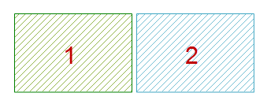
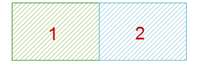
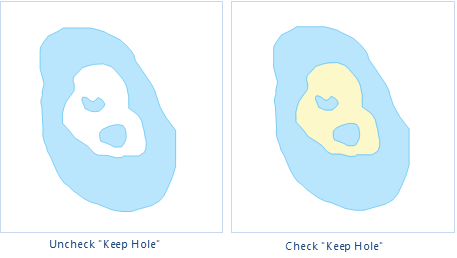

A polygon that has one or several holes is a complex geometry object type. We call it Doughnut and Island Polygon which is created from two or more region objects with the inclusion relation. For example, we can create a lake in an area.

### Introduction

* The doughnut and island polygon is used in region layer or the CAD layer.
* Select two or more region objects to conduct doughnut and island polygons, as shown below: 
  * If the selected regions don't interact, a complex object will be created.
  

* If the selected region objects intersect in point or line, these region objects will be merged to a complex object. 

* If the selected region objects interact in region and don't overlay, when the region number is odd number, the intersection of regions is reserved and a complex object is created. When the region number is even number, the intersection of regions is deleted and a complex object is created.

* If the selected region objects fully coincide and the number is odd number, a region object will be created; When the number is even number, all the region objects will be deleted.

Conduct the doughnut and island polygons for three overlapped circles, finally a circle region is created; If there are only two circles. the result is null.

### Basic Steps

1. Select one or more editable region objects. 
2. Click the **Object Operations** tab > **Object Edit** Gallery > **Object Operations** group > **Doughnut and Island Polygon** button. 

In the "Doughnut and Island Polygons" dialog box, you can set the operation for every field and select several fields to set uniformly. The followings is the instruction.

* **Layer** : The drop down lists all the editable layers in current map. You can select the layers to operate by clicking the right drop-down arrow key.
* **Field** : This area lists the information of all the non system fields and the editable system fields in current editable layer, including name, type and the operations for new object fields. Use the field attributes of the first object.
* **Operation** : It provides four methods. 
  * **Null** : This field of new object is null after operating.
  * **Sum** : After operation, the field of new object is the sum of the corresponding fields of the source operation objects.
  * **Weighted Mean** : After operating, this field of the new object is the weighted mean of all the source object fields. It need to specify the weighted field. If don't select the weight fields, calculate the average. It means to plus all the fields of source objects, then divide the number of source objects.
  * **Save Geometry** : After operating, this field of new object is the same as the field of current selected object. You can click the right drop down arrow and select the object attribute value used by new object.
* **Keep Hole** : Check the checkbox to save the hole in the result of the hole polygon operation as a region object, so that the user can perform settings and other operations on the object.

3. Click "OK" to finish.
