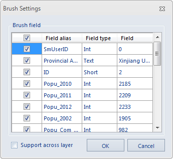

The Attribute Brush is to assign the values of certain editable fields of one object to those of another object that has fields of the same name and type.In applications, you can use this function to assign the value of the land type field of one land parcel to another parcel of the same type.

### Instructions

  * This function is applicable to all vector layers, including point/line/region layers and CAD layers. 
  * Click the Attribute Brush button and in the popup dialog box "Attribute Brush Settings", set the fields to update. 
  * The Attribute Brush can be applied on multiple objects in a continuous way.
  * You can drag a rectangle and select multiple objects in the same time and update the fields of them. 
  * This function is applicable to multiple layers. So you can update the fields of objects in other layers.
  * Enabling the feature Map Snap makes the program snap objects automatically to improve the efficiency of processing data when using the attribute brush. 

### Steps

  1. Select an object in a layer and then its field information will be taken as the base attribute value. 
  2. In the " **Object Operations** " tab on the " **Object Operations** " group, click the Attribute Brush button  and the "Brush Settings" dialog box pops up: 

    
Figure: "Attribute Brush Settings" Dialog Box  
  3. In the "Brush Settings" dialog Box, check the fields that you want to apply the template values to. If you also want to apply the values to objects in other layers, you can check the "Support cross layer" option. Note: The Attribute Brush function is not applicable to binary fields.
  4. Click OK to finish. Now you can select any object as the template. 
  5. And then select any objects to apply to the template values. 
  6. Click ESC or right click your mouse to cancel the operation.

###  Note

The Attribute Brush records history settings of fields. It helps users reduce the times of setting fields when using the attribute brush.