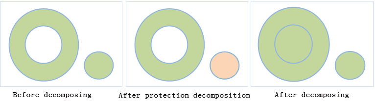

It is to decompose the region object which has multi-layer Island hole nesting relationship into only one layer. The difference between protective decomposition and decomposition is: if the region has Island hole nesting relationship, protective decomposition will keep the simplest layer, but decomposition will not.

### Introduction

  * It can be used for a region or CAD layer.
  * Only a complex object or compound object can be decomposed, simple objects can not be decomposed.
  * For complex objects (objects that contain multiple sub objects), the generated objects are single objects (except the island hole region); for the compound object, firstly it is decomposed into multiple objects, if the object is still a compound object, it will be decomposed again into simple objects. 

As shown in the following diagram it is a combination of an island hole object with another object, after the protection decomposition, the new objects are obtained as a island hole object and a single object:

  
Figure: protection decomposition for complex objects  

  * The new object will keep the field SmUserID and the non system field information, and its other system fields will be assigned values by the system.

### Basic Steps

  1. When the layer is editable, choose a or more complex or compound objects.
  2. Find Object Operations tab>Object Editing group, click the Protective Decomposition button, and perform protection decomposition. 