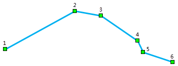
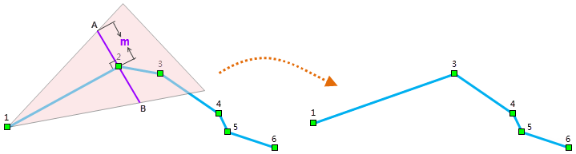
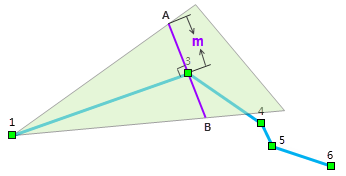
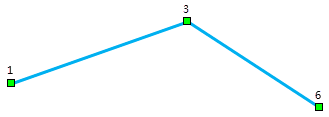

---
id: ReSampleIntro
title: Resample
---  
Line resampling removes vertices from the line or the boundary line of the region while trying to keep the original shape.

When resampling, whether a vertex will be removed depends on the resample distance and the relationship between the positions of the vertex and its previous and next vertexes.

  1. The following example illustrates how a polyline containing six vertices is resampled.

  2. Make a line passing through vertex 2 and perpendicular to line 12. Find the two points A and B on the perpendicular line whose distances to vertex 2 are equal to the specified resample distance. Judge whether vertex 3 is in the resample area. Remove vertex 2 if vertex 3 is within the resample area; otherwise, keep vertex 2. As we see, vertex 3 is within the resample area, so vertex 2 will be removed.

  3. Connect 1 and A, 1 and B and extend the two lines to form the resample area, as shown in green in the figure below.

  4. Vertex 5 and 6 are both within the resample areas, therefore, only vertex 1, 3 and 6 are kept. The polyline after resampling is shown as below.

