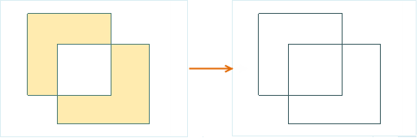
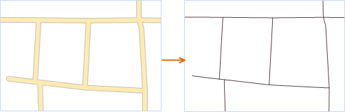

### Introduction

It is to convert the boundary line or central line of the selected region into the line object, and save it to a line or CAD dataset. It supports two modes: the boundary line and central line, as shown below:

### Basic Steps

1. Open your region dataset, then select one or more region objects when the current region layer can be selected.
2. Click the **Object Operations** tab > **Object Edit** Gallery > **Conversion** group > **Region to Line** button.
3. In the dialog box, select the target datasource and dataset of the new regions. The result data is stored in two ways: save it to the existing dataset or create a new line dataset. The parameters in the dialog are set as follows: 
  * **Target Datasource** : the datasource the target dataset is in.
  * **Target Dataset** : the existing line or CAD dataset, to save the new lines.
  * **New Dataset** : check it to set the new dataset name and save the line objects in it. If you don't check it, the new generated lines will be saved to the target dataset, and their property fields will be added into the attribute table of target dataset.
4. **Region to Line** : click the drop-down button and choose the mode from two options Extract boundary and Extract center line. 
  * **Extract Border** : convert the boundary line of the region to a line.
  * **Extract Center Line** : convert the center line of the region to the line object. When selecting the center line mode, the maximum width and minimum width are required. The region whose width is between the maximum and minimum value will be exacted the center line; the region whose width is less than the minimum value will not be processed; the region whose width is larger than the maximum width will be extracted the boundary line. For details please [Region to Center Line](../../Vector/RegionToCenterLine).
5. **Delete Source Object** : If the layer the selected regions are is editable, you can check the Delete source object to delete the selected regions in the source dataset.
6. Click **OK** to finish.

### Note

1. One region object will be converted to one line object. The grouped region object will be converted to a grouped line object.
2. The compound object built by multiple regions in a CAD layer is not supported being converted to lines.

