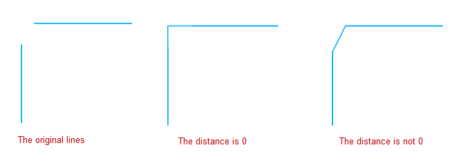
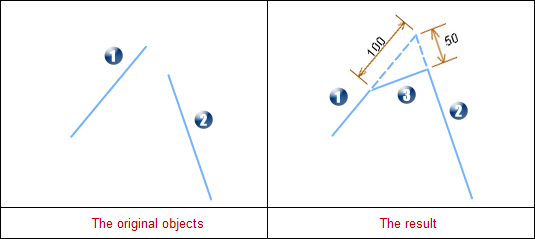
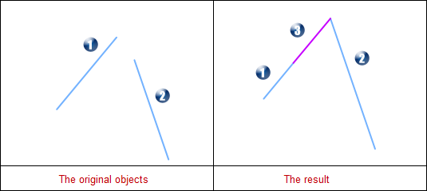
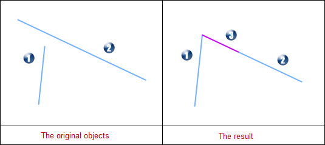
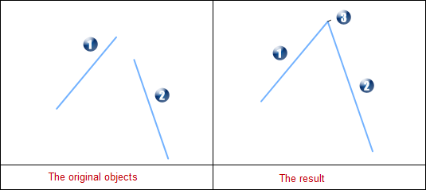
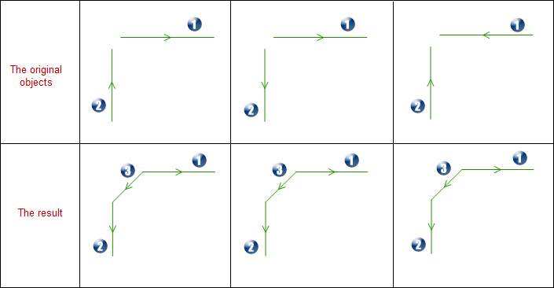

The "Chamfer" order of "Objects Editing" group in "Objects Operations" provides the function for generating chamfer. The chamfer is similar to the fillet, which is joint the two objects. The fillet is jointed by the smooth arc and the chamfer is jointed by the flat angle. The effect of chamfer is to make the angle more beautiful, smoother and meet the practical needs.

Extend or trim the near endpoints of two segments and generate a chamfer. As shown below, when the two chamfer distance are 0, it will trim or stretch the two lines until they intersect. When the two chamfer distance aren't 0, it will stretch the two segments according to the specified distance, then connect these two lines.

  

  
### Introduction

  * Only select two segments in the editable layer, can the "Chamfer" button be available. That is to say, this function is valid for the selected two segments.
  * The objects that participate in creating the chamfer should be simple line objects, and the extension cord only has one node. If the two straight lines are parallel or in the same line, the operation is not successful.
  * After finished this operation, the source line may stretch or trim, but the attribute information won't be changed. 
  * Introduction for Chamfer Distance Parameters: When create the chamfer, it has strict restrictions for the distance parameter. The range of the distance parameter is the distance from the intersection of two lines to the farthest nodes. For the distance exceeds this length, the application will give error message.
  * Although the intersection lines can operate this function, it hasn't the geological significance. So we don't introduce this condition.

### Basic Steps

  1. Set the layer that the lines need to be chamfered as editable layer.
  2. Select two segments in the layer (No-parallel lines).
  3. In the "Objects Editing" group of "Objects Operations" tab, click the  button and pop up "Chamfer settings" dialog box. Input the distance between the first and second lines. The default distance between the first line and second line is 0, and connect thw two lines in the intersection.
  4. Set whether to trim source object. If check this box, it will trim the source objects after operated; Otherwise, retain the source objects.
  5. The map window will display the chamfer effect real-time. Click "OK" button to execute this operation according to the users' settings.

### Note

  * **Parameter Introduction**

Distance for 1st Line: After trimming or stretching the first line, it is the distance from intersection of extension cord in first line to the nearest end point. As shown below, the distance for 1st Line is 100.

Distance for 2nd Line: After trimming or stretching the second line, it is the distance from intersection of extension cord in second line to the nearest end point. As shown below, the distance for 2nd Line is 50.

  

  
**Photo Caption**

1\. 1 represents the first line, and 2 represents the second line, and 3
represents the new chamfer.

2\. The first line is trimmed and the second line is stretched.

  * **Introduction for distance range**

The minimum distance is 0; And the maximum is the distance from the 
intersection of two lines to the farthest end. If the input value is larger 
than the maximum, the export window will prompt: Grater than Maximum Value!.

If the distance is 0, the chamfer line will have some changes and please refer 
to the following graphical representation and illustration.

The first line is the chamfer distance | The second line is the chamfer distance | Illustration | Description  
---|---|---|---  
0 | non-zero |  |  The first line is stretched to the intersection of the two lines. The second line is trimmed. The new chamfer line is in the extension line of first line in result and the length is the chamfer distance of first line.  
non-zero | 0 |  | The first line is trimmed. The second line is stretched to the intersection of the two lines. The new chamfer line is in the extension line of second line in result and the length is the chamfer distance of second line.  
0 | 0 |  | The first and second line stretch to the intersection. The new chamfer is in the intersection and it is a false right angle with 0.  
* **Direction Introduction**

After finished this operation, the direction of source line will change. See the following graphical representation and illustration for more informations.

  

**Photo Caption**

1\. 1 represents the first line, and 2 represents the second line, and 3 represents the new chamfer.

2\. The direction of the new chamfer is from first line to the second line.

3\. The direction of the first line is contrary with the new chamfer direction.

4\. The direction of the first line is the same as the new chamfer direction.