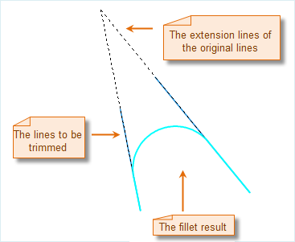
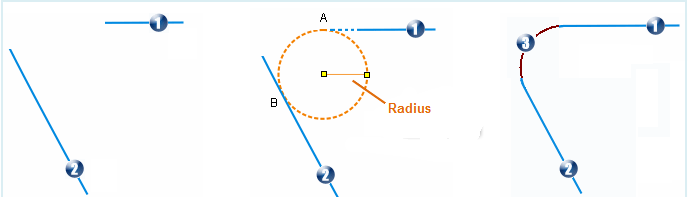

Connect two lines with an arc with a specified radius.

### Instructions

* Please notice that the Fillet command is only active if there are two editable non-parallel line segments.
* The objects involved the fillet operation must be simple line objects, and their extended lines must have one and only intersection. If two straight lines parallel to each other or are in the same straight line, the operation will be unsuccessful.
* Although the fillet operation can be performed on cross lines, but there is no obvious significance in geoscience. So this situation is not described in detail.

 ### Basic Steps

1. Set the layer where you want to implement the fillet operation editable.
2. Select two non-parallel line segments in the layer.
3. Click the **Object Operations** tab  **Object Edit** Gallery  **Edit Node** group  **Fillet** button to open the **Fillet Settings** dialog box. The default arc radius is one-fifth of the radius of the maximum incircle of the two selected lines. The radius unit is the same as the coordinate system unit of the layer.
4. Set the radius of the circle that is tangent all the selected two lines. The position and size of the resulting arc depend on the radius. You can preview the result with the radius setting, thereby choosing whether to trim the source lines.
5. Checking **Trim Source** trims the source lines.
6. Click **Yes** to finish the operation.  

  

7. The operation result description: the system firstly uses the radius you entered to create a temporary circle that is tangential to the two line segments, and then locates the tangent points in each line object. If the  tangent point is located on the line object, the system will remove the line segment that extends beyond the tangent point; if the tangent point is located on the extension of the line object, the system will extend the line to the tangent point. The curve between the two tangent points will be kept to generate a new line object. Its attribute records will be added to the end of the attribute table. Its system fields will be assigned by the system and non-system fields will be Null. The original lines will retain their attributes. 
Operating results are shown as follows:  

  

