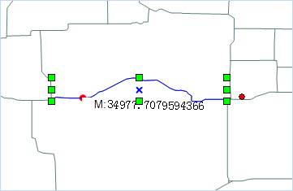
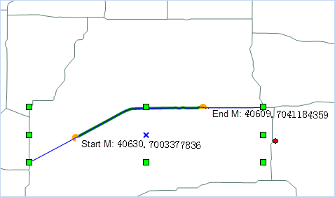
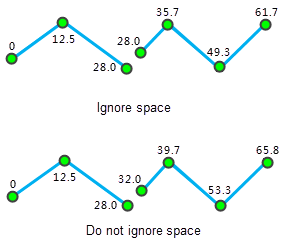

### Add Point/Highlight Line based on M Value

Adds a node with the specific M value on the selected route line object or highlights the route segment based on the starting and ending M values.

**Basic Steps**

1. Open your route dataset and set the layer editable. Then select a route object you want to add a node.
2. Click the **Object Operations** tab  **Object Edit** Gallery  **Route Editing** group  **Add Point** button to open the **Add Point or Highlight Line with M Value** dialog box.
3. Check Add point to add the node with a specific M value in the route line object with the two ways:

  * In the edit box, enter a M value, for example, input 100, then the point whose route M value is 100 will be highlighted on the map, click the Add button, then add a node on the route object.

  * Click the arrows button on the right side. Then hover your mouse on the selected route object to check the M value and the current coordinates. Left-click your mouse on the map and click on the Add button in the dialog box to add the point to the selected route object.

   

4. Check the **Highlight Line** check box, enter the M values in the start M value and end M value box, or click the arrow button to pick up the appropriate M location on the map window respectively. Then the route line segment between the two M values will be highlighted in the map. As shown below:

   

5. Click Close to finish.

 ###  Note

The input M value of the node must be between the minimum and maximum M value; the range of the start and end M values of the highlighted line segment is between the minimum and maximum M value of the selected route object.

 ### Calibrate Route M Value

Route object is a set of linear feature objects having X, Y coordinates, and linear M values. For example, the milestone on the highway, traffic control departments often use the milestone to mark and manage highway condition, driving speed limit, vehicle accident points. etc. Route object M calibration is adjusting the route M values, making it consistent with the known reference point. For more about route calibration, please refer to [Route Calibration Overview](../../../DynamicSeg/AboutCalibrate).
 **Basic Steps**
1. Add the route data into a map window and set the layer to editable. Select one route object that needs M value calibration.
2. Click the **Object Operations** tab  **Object Edit** Gallery  **Route Editing** group  **Calibrate M** button to open the **Calibrate Route Object's M Value** dialog box.
3. The list of the dialog box display route object coordinates and M values. Users can check route node as reference point for M value calibration. The selected route object node will be highlighted in the map and users can directly modify the M value of the reference point in the list.
4. **Method** : Calibrate M values by distance or by scale. See [Calibrating Route Overview](../../../DynamicSeg/AboutCalibrate) for more information.

  * **By Distance** : Calculate M value according to distance of the reference point along the route.

  * **By Measure Value** : Calibrate according to the measure value on the
route corresponding to the reference point. When the length and the measure
value are not consistent with each other for a route, this method is very
suitable for tuning the measure values of the route.

5. **Ignore the subobject space** : Set whether to ignore the space of the
child objects. By default, the space will be ignored. The route may contain
multiple child objects. If the two child objects are not connected, a gap will
occur. If the gap is ignored, the measure values are continuous.

 As shown below: M value of the end node of the first child object is the
same with the M value of the start node of the second child object if the
child object space is ignored; M value of the start node of the second child
object is sum of M value of the end node of the first child object and the
straight-line distance of the gap between the two child objects if the child
object space is not ignored.

   

6. After setting the parameters, click the **Calibrate** button to perform the operation.

 ###  Note

1. There should be at least 2 reference points for route calibration. It
is suggested that the two reference points nearest to the node that needs
calibration.

2. If the M value is -9999, the calibration will fail.

 ### Delete M

 Sets all M values of one or multiple selected Route objects to -9999.

 **Basic Steps**

1. Select one (or multiple) editable route object.

2. Click the **Object Operations** tab  **Object Edit** Gallery  **Route
Editing** group  **Delete M** button.

3. Checking the route object's value, you will find its M vlaue is -9999.

 ###  Related Topics

  [Calibrating Route Overview](../../../DynamicSeg/AboutCalibrate)

  [Calibrating Route](../../../DynamicSeg/CalibrateRoute)

