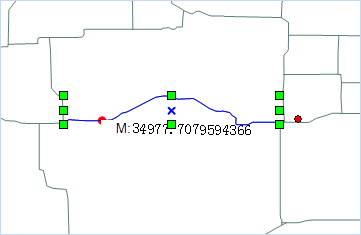
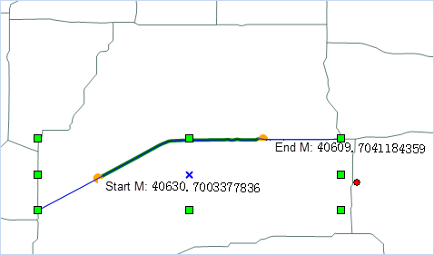

### Introduction

Add a node with the specific M value for the selected route line object; or highlight the route segment between two M values based on the starting and ending M values.

### Basic Steps

1. Add the route dataset to the map window, make the layer editable, select a route object to be added a node.

2. Click Object Operations>Object Editing>Add Point/Highlight Line based on M Value to prompt the Add the point/highlight line based on M dialog.

3. Check Add point to add the node with a specific M value in the route line object with the two ways:

    * In the edit box, enter a M value, for example, input 100, then the point whose route M value is 100 will be highlighted on the map, click the Add button, then add a node on the route object.

    * Click the  button on the right side of the M combo box, move the mouse to the selected route object, which will show the M value and the coordinates of the location of the mouse, click in a suitable position, click the Add button in the dialog box, it will add the point to the selected route object.

      
    Figure: Add Point  

4. Check the HighlightLine check box, enter the M values in the start M value and end M value box, or click the  button, pick up the appropriate M location on the map window respectively, then the route line segment between the two M values will be highlighted in the map. As shown below:

  
Figure: Highlight the Route Line Segment  

5. Click Close to finish.

###  Note

The input M value of the node must be between the minimum and maximum M value; the range of the start and end M values of the highlighted line segment is between the minimum and maximum M value of the selected route object.