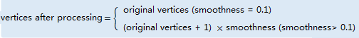

The **Object Editing** group on the **Object Operations** tab provides a
function to process boundaries for line or region geometric objects. The
smooth function is mainly used to smooth boundaries for line or region
geometric object, turning the polyline into a smooth line object.

Controls in the Processing group are only active when there are selected
geometric objects (line or region geometric objects) in editable layers in the
map window.

### Instructions

* Smooth the lines or the boundary lines of regions.

* The smoothness indicates how smooth the line or the boundary of the
region will become. It is proportional to the number of vertices. It is an
integer raging from 0 to 2147483647. The relationship between the smoothness
and the number of the vertices is shown as below.  

  

* For the smooth principle, see [Smooth Methods](../../Vector/SmoothMeth).

* The line object involved in the smooth operation must have more than
three nodes (including three). Because the straight line between two points is
already smooth.

 ### Basic Steps

1. Set the layer in which you want to smooth objects editable.

2. Select the line or region objects to smooth.

3. Click the **Object Operations** tab > **Object Edit** Gallery > **Object Operations** group > **Smooth** button to open the **Smooth Settings** dialog box.

4. Input a smoothness value in the text box **Smoothness**. The default value is 4.

5. Repeat step 1 to 4 to implement another smooth operation.

6. Click **OK** to finish the smoothness.

 ### Note

You can smooth objects in multiple layers at the same time if the multilayer editing function has been enabled.
