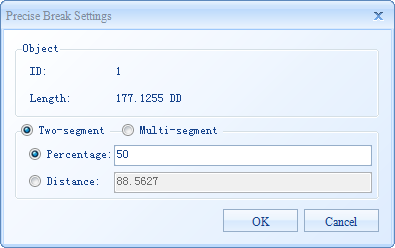
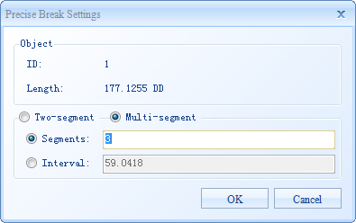

Break a line object precisely with different break methods.

### Instructions

  * The precise breaking function applies to line layers and CAD layers.
  * Modes of the breaking include breaking by distance, by percentage, by segments or by interval. 
    * Distance mode: the line object is split precisely by using a specified distance value. After that, the line object will be split into two parts.
    * Percentage mode: the line object is split precisely by a percentage of the line object. After that, the line object will be split into two parts.
    * Segments mode: the line object is split precisely by the number of segments. It allows users to specify the number of segments, and the line object will be split into several segments with equal lengths. After that, the line object would be divided into a specified number of segments, and one or more new objects would be created.
    * Interval Mode: the application can automatically calculate the number of segments to split by a specified interval. If the length of the last segment is less than the interval, the segment will still be treated as a segment. For example, the length of a line object is 13, and the interval is set to 5. After breaking it by interval, the line object is split into three segments including two segments with the length of 5 and one segment with the length of 3.
  * Breaking closed objects. In SuperMap, a closed object (such as a circle or a rectangle) is treated as an object with superposed beginning and end. We call the superposed beginning and end endpoints. For closed line objects, after the break operation, the system will automatically split the endpoint of the closed object at the same time.
  * The splitting result description. The original line is deleted and multiple line objects are generated. Their system field values are assigned by the system and non-system field attributes keep that of the original line object.

### Basic Steps

**         Breaking into two segments**

  1. In an editable layer, select an object to split.
  2. In the Object Operations tab and on the Object Editing group, click the Accurate Split button in the Gallery controls.
  3. In the pop-up Precise Break Settings dialog box, you can browse the object information including the object ID and object length, and also you can set the way of precisely breaking. Choose a breaking way: two-segments. SuperMap desktop product provides two modes to split a line to two segments: by distance and by percentage. Choose a breaking mode according to operational needs, and input a distance or percentage from start point to the splitting point on the right side.
   
Figure: Precise Break Settings dialog box  

  4. Click OK to finish. 

The selected object is split at a specified distance or percentage of the total length, and is displayed in the map window using the red and blue highlights.

**         Breaking into multiple segments**

  1. In an editable layer, select an object to split.
  2. In the **Object Operations** tab, on the Object Editting group, click the **Acurate Split** command.
  3. In the pop-up Precise Break Settings dialog box, you can browse the object information including the object ID and object length, and also you can set the way of precisely breaking. Choose a breaking way: multi-segments. SuperMap desktop product provides two modes to split a line to two segments: by segments and by interval. Choose a splitting mode according to operational needs, and input a number of segments or interval on the right side.
  
Figure: Precise Break Settings dialog box 

  4. Click OK to finish. 

The selected object is split at a specified number of segments, and is displayed in the map window using the red and blue highlights.

### Note

It can't support to split accurately for the parameterized object, such as the
arc, three points arc and spline, etc, the splitting function will be invalid.
The parameterized object is in the CAD dataset.