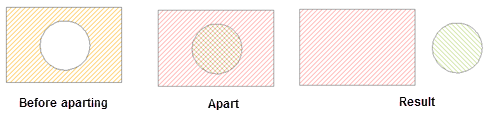
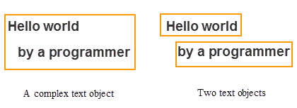
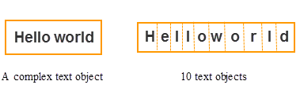

Ungroup one or more compound objects into simple or compound objects.

### Introduction

  * The ungroup function applies to line layers, region layers, text layers and CAD layers.
  * It can only be performed for complex or compound objects; simple objects cannot be ungrouped. 
  * For complex objects (the object contains multiple sub non-text objects) ungrouping, all generated single objects are simple objects. For compound objects, after multiple single objects are generated, if there is still any compound object exists among these result single objects, you can continue perform the ungroup operation until all result objects become simple objects. 

The figure below shows a hole polygon. After performing the ungroup operation two single objects are generated:

  
Figure: ungrouping a complex object  

  * Two ways are provided for decomposing text. 
    * Simply Decompose: Decompose a complex text object into multiple sub text objects.  
      
Figure: Simply Decompose  
    * Thoroughly Decompose: Decompose text objects into single letters.  
      
Figure: Thoroughly Decompose  
  * In the attribute information of the newly generated object, values of the SmUserID field and non-system field will keep that of the original object, and the other system field values are assigned by the system. 

### Basic Steps

  1. In an editable layer, select one or more complex objects or compound objects.
  2. In the **Object Editing** group on the **Object Operations** tab, click the Ungroup button. 

Or do the followings:

Click the right mouse button, and select **Ungroup** command in the pop-up menu.

  3. If there is still any compound object exists among the ungrouped resulting objects, you can continue perform the ungroup operation until all result objects become simple objects.