---
id: UpdatePartly
title: Partial Refresh  
---  
You can use the function to modify any line or region object with a polyline. A new object will be created by intersecting the polyline and the target object.

### Instructions

  * This function is applicable to line/region/CAD layers. 
  * It is advised you enable the snapping settings when drawing the polyline. 
  * You can select the object to be updated and clip with a polyline. The polyline shall have at least two intersections with the object to be updated. 
  * The object to be updated can be a simple object or a sub-object of a complex object, but not a compound object. 
  * The result of this operation is different depending on the type of the target object to be updated.
    * **The object to be modified is an unselected line object(Snap Mode).**

The following illustrates the operation for this case.

Figure1 is the target line to be modified, and Figure 2 is the polyline used to modify. The start and end node of the polyline must be on the line object.
The highlighted segement in Figure2 is the modification result.

The polyline splits the target line into 3 segments. You can press Ctrl or Shift to switch between the parts, as illustrated in Figure3.

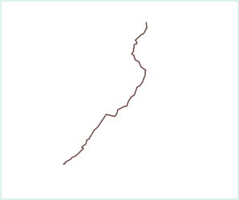 | 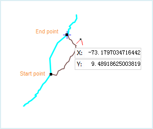 | 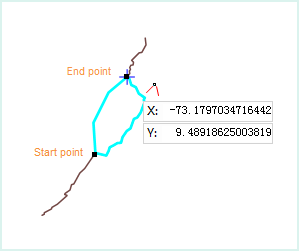  
---|---|---  
Figure 1: The Object to Update | Figure 2: Partial Refresh | Figure 3: Switch
between parts  
    * **The object to be modified is a selected unclosed line object(Clip Mode)**

The following illustrates the operation for this case.

Figure 1 is the target line to be modified, and Figure 2 is the polyline used to modify. The polyline must have at least two intersections with the target line object. The highlighted segement in Figure2 is the modification result.

The polyline splits the target line into 3 segments. You can press Ctrl or Shift to switch between the parts, as illustrated in Figure3.

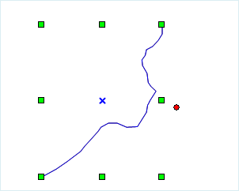 | 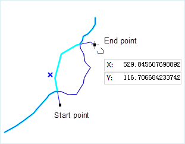 | 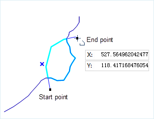  
---|---|---  
Figure 4: The Object to Update | Figure 5: Partial Refresh | Figure 6: Switch
between parts  
    * **The object to be modified is an unselected region object(Snap Mode)**

The following illustrates the operation for this case.

Draw a polyline with its start and end node right on the boudary of the region
object. The highlighted white section in Figure2 is the modification
result.You can press Ctrl or Shift to switch between the parts, as illustrated
in Figure9.

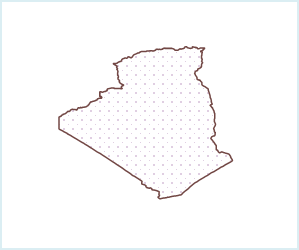 | 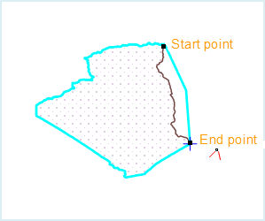 | 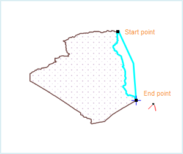  
---|---|---  
Figure 7: The region object to update | Figure 8: Update Result1 | Figure 9:
Update Result2  
    * **The object to be modified is a selected region object (Clip Mode).**

The following illustrates the operation for this case.

Draw a polyline. The polyline must have at least two intersections with the target region object. The highlighted blue part in Figure11 is the modification result. You can press Ctrl or Shift to switch between the parts, as illustrated in Figure12.

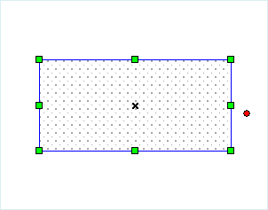 | 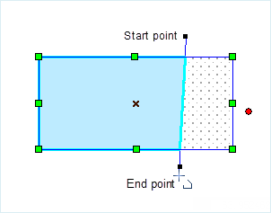 | 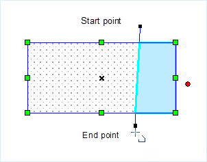  
---|---|---  
Figure 10: The region object to update | Figure 11: Update Result1 | Figure
12: Update Result2  
  
### Steps

    1. In the layer manager, set the target layer to be editable.
    2. Click " **Object Operations** " -> " **Object Editing** ", and click the button Partial Refresh. You will see the cursor changes to. 
    3. You can use two modes to use this function and modify the objects in the layer: Snap mode and Clip mode. If the object in the layer is not selected, you can only use the Snap mode. If the object is selected, you can use either Snap or Clip mode. 
      * **Snap Mode** : Move your cursor to the target line or the boundary of the target region feature. The starting and ending node of the polyline must be on the target line or the boundary of the target region feature, otherwise, you will get a prompt message in the output window: The point should be in the line when updating with capture mode. Please select an object if you want to update with clip mode.
      * **Clip Mode** : Select the target object in the map window that you want to modify with a polyline. Make sure that the polyline has at least 2 intersections with the target object.
    4. Draw the polyline and the updated part of the target object will be highlighted. The polyline will split the target objects into multiple parts. You can press Ctrl or Shift to switch between the parts and decide which part to change.
    5. Right click your mouse to complete the operation. 