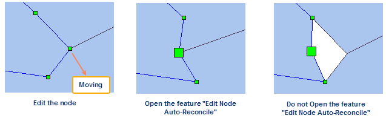

In the "Object Operations" and on the Object Editing group, commands for adding, editing vertices of geometric objects are provided.

Vertex is one of a set of ordered x,y coordinate pairs that defines the shape of a line or region object. Text objects have no vertices.

Note: This editing function only supports lines and regions, but the ellipse, arc doesn't support this function. After clicking an object, right click to choose the Property item, and see the object type.

    * **Edit:**

Change the shape of the selected line or region object by moving or deleting vertices.

Basic Steps:

      1. Make the layer editable.
      2. Select a line or region object.
      3. Click the Edit button in the Object Editing group. All vertices of the selected object are displayed.
      4. Moving vertices. Select a vertex, drag it to an desired location while holding down the left mouse button, and then release the mouse button. Move the other vertices with the same method.
      5. Deleting vertices. Select one or more vertices and click Delete. To select one vertex, click on it. To select several vertices, use Shift/Ctrl + click.
      6. Go on deleting the vertices of other geometric objects with the same method.
      7. Click Edit again to exit the vertex moving and deleting mode.
      8. Repeat steps 1 through 7 to edit vertices in another layer.
    * **Edit Node Auto-Reconcile** : When you are editing vertices of lines or polygons, you can open the feature, and then:
      * When dragging or deleting a common vertex of adjacent region objects, the objects will automatically maintain the border avoiding modification of nodes and topological problems such as existing gaps or overlaps to improve work efficiency.
      * When doing the dragging or deleting operation to a common point of adjacent lines, the lines will adjust their shapes as the position of vertices automatically.
  
---  
  
Basic steps:

      1. In the "Object Operations" tab and on the "Drawing" group, click "Drawing Settings" and then click "Edit Node Auto-Reconcile" to open it.
      2. Move the mouse to the vertex which you want to modify and hold down the left mouse button and move the mouse. Or click Delete to delete the vertex. After modifying the vertex, the geometry shape of the adjacent region object changes but always keeps the adjacency. If a common vertex of line objects is edited, the shapes of lines will be adjusted automatically.
      3. Cancel the selection status, the feature Edit Node Auto-Reconcile is closed too.
  * **Add:**

Add vertices for the selected line or region object.

Basic Steps:

    1. Set the layer in which you want to edit the geometric object.
    2. Select a line or region object.
    3. Click Add in the Object Editing group. All vertices of the selected object are displayed.
    4. Click on the boundary of the geometric object to add a new vertex for it.
    5. Go on adding vertices for other geometric objects with the same method.
    6. Click Add again to exit the vertex adding mode.
    7. Repeat steps 1 through 6 to add vertices in another layer.