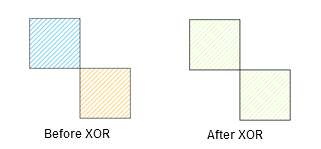
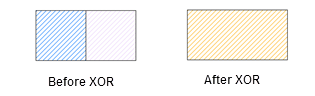
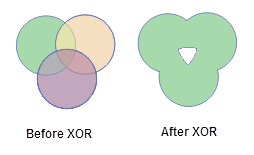
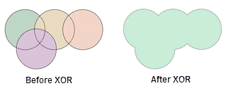
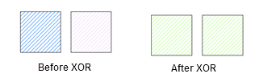

Get the union of two or more objects after removing the common parts.

### Instructions

During the XOR operation, there will be a variety of special circumstances.
These cases are described separately as follows.

  * If the objects involved in an operation intersect only at points, these region objects will be merged into a complex object (The figure below shows the generation of a complex region object with two sub objects). 
     

  * If the objects involved in an operation intersect only at lines, adjacent edges of these objects will disappear, and the objects will be merged into a simple object.  
    

  * If the objects involved in an operation intersect each other at regions (not coincide), the mutual intersection part will be removed, and the objects will be merged into a complex object (The figure below shows the generation of a complex region object with two sub objects).  
    

  * If the objects involved in an operation intersect each other at regions without mutual intersection (common intersection part), all objects involved in the operation will be merged into a simple region object.  
    

  * If the objects involved in the operation coincide with each other, all objects involved in the operation will be deleted. 
  * If the objects involved in the operation do not intersect each other, it will generate a complex object (The figure below shows the generation of a complex region object with two sub objects).  
    

### Basic Steps

  1. In an editable layer, select two or more objects.
  2. In the **Object Edit** group on the **Object Operations** tab, click **XOR** button to bring out the attribute assignment dialog box.
  3. In the attribute assignment dialog box, set the object to be retained. More details about the attribute assignment dialog box for the XOR operation and its parameters please refer to the [ attribute assignment dialog box description](AttributeDiag.htm). 
  4. Click OK to finish.