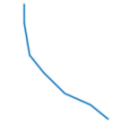

The **Scale** creates an object that the shape ratio unchanged with the original object according to the specified distance.

### Introduction

* The Scale operation is applicable to line layer, region layer, and CAD layer.
* The Scale operation is applicable to not only simple objects, but also the complex objects. For the complex objects, the feature will zoom every child object at a uniform distance. 
* The parameterized objects in the CAD layer (such as regular polygon, pie and so on), and composite objects don't support the feature.
* If the input distance is positive, it indicates upward scale; if the input distance is negative, it indicates down scale. 

### Basic Steps

1. Click the **Object Operations** tab > **Object Edit** Gallery > **Object Operations** group > **Scale** button. 
2. Select the object (the line object or the region object) which you want.
3. Drag the cursor and you can see a temporary object whose shape is the same as the selected object moving as you move the cursor. 
4. Right click on the proper position to complete the operation. 
5. If you want to precise scale, please type a distance in the text box and press Enter key. 
6. To keep zooming the selected object, repeat step 5 and 6.
7. To end the scale operation, press the ESC key.

The figure below shows an object before zooming and after zooming. Blue is the source object and red is the object after zoom.

### Note

* The result of zoom is creating a new object and save the source object. The non system field attribute of new object stays the same with the source object attribute.
* If the new object interacts with itself, the zoom distance of line object should be less than the distance between any two points; For the simple region object, the zoom distance should be less than half distance between any two points.

