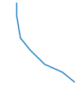
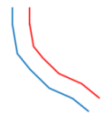

Zoom means to create an object that the shape ratio unchanged with the original object according to the specified distance.

### Introduction

  * The zoom operation is applicable to line layer, region layer and CAD layer.
  * The zoom operation is applicable to not only simple objects, but also the complex objects. For the complex objects, every child object in the complex object zoom according to the same zoom distance. 
  * The parameterized objects in the CAD layer (such as regular polygon, pie, and so on), and composite objects don't support the zoom.
  * If the input distance is positive, it indicates upward zoom; if the input distance is negative, it indicates down zoom. 

### Basic Steps

  1. In "Object Editing" group of "Object Operations", click the Zoom button to operate.
  2. According to the "Select an object to zoom" prompt in the output window, select an object (the line object or the region object) as the zoom object.
  3. Drag the cursor and you can see a temporary object whose shape is the same as the selected object moving as you move the cursor. 
  4. Move the cursor to the right position and left-click the mouse to complete the zoom operation. At this point, the distance between the newly generated object and the zoom object is the distance you entered. 
  5. If you want to precise zoom, type a distance in the text box and press Enter key to complete the set. 
  6. To keep zoom the selected object, repeat step 5 and 6.
  7. To end the zoom operation, press the ESC key.

The figure below shows an object before zooming and after zooming. Blue is the source object and red is the object after zoom.

 |   
---|---  
An object before zoom. | An object after zoom.  
  
### Note

  * The result of zoom is creating a new object and save the source object. The non system field attribute of new object stays the same with the source object attribute.
  * If the new object interacts with itself, the zoom distance of line object should be less than the distance between any two points; For the simple region object, the zoom distance should be less than half distance between any two points.