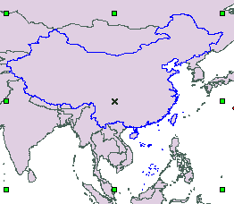
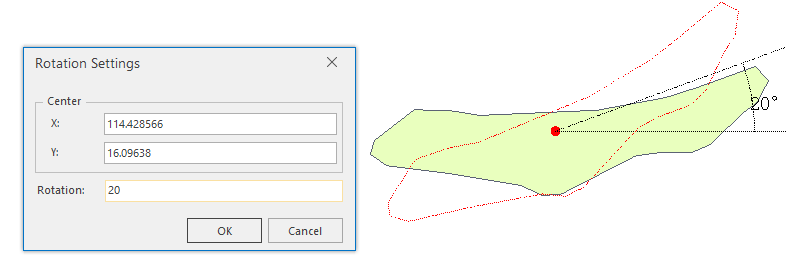

Rotate object(s) in an editable layer.

### Instructions

* **Pivot and Rotation Center**

The pivot is the upper left corner of the geometric object bounding box, and the rotation center (X-shaped as shown below) is located inside the geometry object. When making geometric objects rotate, the pivot keeps still, and the geometric object is rotated around the rotation center at the angle you specified.

When multiple objects are selected, the pivot is the upper left corner of the common bounding box of these objects.

  
Figure: Rotation settings dialog box  

* SuperMap supports rotation operation for point layers, line layers, region layers, text layers, CAD layers and routing layers.

* During the rotation, you can make the object rotate to the target position by dragging or manually entering the rotation angle.

### Basic Steps

**Dragging rotation**

1. In an editable layer, select one or more objects.

2. Place the cursor on the rotate handle, when the cursor becomes , hold down the left mouse button, drag the object to the position you want, and release the left mouse button.

**Precise rotation**

1. In an editable layer, select one or more objects.

2. In the **Object Editing** group on the **Object Operations** tab, click the Rotate button to bring out the Rotation Settings dialog box.

3. The rotation center shows its (X, Y) coordinates. The default rotation center is the anchor on the upper left corner of the bounding box of the geometric object. You can reset the rotation center by modifying the (X, Y) coordinates.

  
 
4. Entering a positive angle value rotates the objects counterclockwise, whereas entering a negative angle value rotates the objects clockwise.

5. Click OK to rotate.