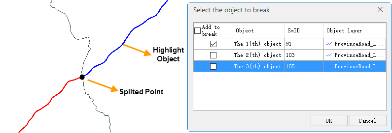

Break a line into two or multiple lines.

### Instructions

  * The breaking mode is used to split line objects at any position as the mouse clicks. 
  * It can split line layer objects or line objects in the CAD layer, and it requires the object to be split in an editable layer.
  * During the breaking operation, you can enable the snapping mode to locate the point for splitting easily, quickly and accurately. For example, you can enable the snapping mode when breaking the intersection of line objects.
  * If the selected breakpoint is the intersection of multiple objects, the "Select the object to break" dialog box will be displayed. You can select the object which will be split and the selected object will be highlighted in map.
  * The instruction for breaking closed objects. 

In SuperMap, a closed object is treated as an object with superposed beginning and end. We call the superposed beginning and end endpoints.

For closed line objects such as circles, rectangles, etc., after this operation, they will be split into two objects from the split point and the endpoint.

  * After the breaking operation, the two newly generated line objects display in different temporary colors to distinguish. 

### Basic Steps

  1. In the **Object Editing** group on the **Object Operations** tab, click the Split button.
  2. In the map window, the mouse prompts: Select the line to split. To split an object, click the corresponding position on the target object. The two newly generated line objects display in different colors (red and blue) to distinguish.This operation can continuously split the selected line object. After the breaking operation, the original object will be deleted, and several new objects will be created (the number of the new created objects is the number of the split points plus one). Their system field values are assigned by the system, and the non-system field values keep that of the original object.
  3. When the object is splitting, if the selected point is the intersection of multiple objects, you can check the split object in list and it will be highlighted in map.
  
Figure: Select The Split Object  

###  Note

When the splitting object is the parameterized object, such as the arc, three points arc and spline, etc, the splitting function will be invalid. The parameterized object is in the CAD dataset.