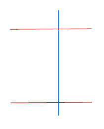

The Trim tool can removed an intersection part if one selected line object (baseline) intersects with another line object.

### Instructions

* To trim objects, use the trim edge defined by the baseline object. When using the trim tool, you should firstly select the line (baseline) which would be used in the trimming process, and then click the intersecting line segments to be trimmed. The part of the line that was clicked by the mouse will be removed.
* It can trim line layer objects or line objects in the CAD layer, and it requires the object to be trimmed in an editable layer.
* The trim operation only works for line objects that intersect with the baseline. No operation would be performed for line objects not intersect with the base line.
* The object to be trimmed must be a simple line object; the baseline can be a complex line object or a simple line objects but not a compound object.
* When you need to trim multiple lines that all intersect with the same line (base line), firstly you can select a line object as the baseline, and then trim the line objects that intersect with the baseline one by one.

### Basic Steps

1. In the **Object Editing** group on the **Object Operations** tab, click the Trim button, at this time the map window prompts: Please select the baseline.
2. Select a line object as a baseline, the mouse will prompt: Click the line to be trimmed.
3. Select the part of the line object that you want to trim off.

After trimming, the baseline is still retained, and the part of the line segment that was clicked by the mouse will be deleted. The system field (except SmUserID) values of the new object are assigned by the system, and values of non-system fields and the SmUserID field will keep that of the trimmed object.

