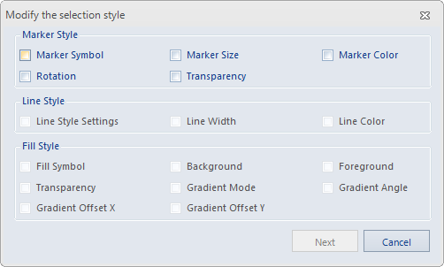

### Description

Sets the uniform display style for the selected objects in a vector layer. Please refer to [Select Object](..\\..\\..\\Visualization\\BrowseMap\\Select.htm) for information about how to select object and set the object parameters.

### Basic Steps

  1. In the Layer Manager, right click the selected vector layer and select "Object Selection Style..." from the menu. 
  2. In the Layer Manager, right click the selected CAD layer and select "Object Selection Style..." from the menu, and select the style from point/line/region style.
  3. If a Unique Values/Ranges thematic map layer or a CAD layer is selected, the "Modify Object Selection Style..." will pop up, as follows: 

  

  4. In the dialog box, check the style item to set. 
  5. Click Next and select a style to apply to all the selected objects. For details, see "Related Topics" . 

###  Related Topics

 [Marker Symbol Style Settings](../../../Visualization/LayerStyle/PointSymStyle.htm)

 [Line Symbol Style Settings](../../../Visualization/LayerStyle/LineSymStyle.htm)

 [Fill Symbol Style Settings](../../../Visualization/LayerStyle/FillSymStyle.htm)