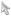

### Description

Controls whether a vector layer can be selected or not.

### Basic Steps

  1. Right click on a vector layer in Layer Manager and click Selectable in the context menu that appears.
  2. When finished, a  will show up in front of the Selectable command, indicating that the layer is now selectable.

### Note

The  button in front of a vector layer in Layer Manager can also control the selectability of the layer. A highlighted button  indicates that the layer is selectable, while a gray button indicates that the layer is unselectable.