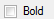
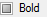
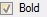

### Introduction

The "Same Text Style..." function is used to set the text to the same style in batch.

### Basic Steps

  1. Open a text layer on the map window, and set the text layer editable.
  2. Select a text object in the map window, right click and choose Same Text Style.... The Similar Text Style window pops up.

  3. The Similar Text Style window offers Filter Similar Text Style and Set Target Text Style. You can set parameters for the two columns.

**Filter Similar Text Style**

Set the text objects in current text layer to a uniform text style. The relation among those parameters is AND. In other words, if you set several parameters, the text objects which meet those standards will be treated as the same text style. If you uncheck a parameter, this parameter will not be considered as a standard. The default values of parameters in Filter Similar Text Style are the values of the text object you selected.

    * **Font Name:** Click on the drop-down list and choose a font as a standard, such as Times New Roman. In this case, the text objects in current layer which meet the standard Times New Roman as well as the other parameters can be treated as the same style. Note: You can type a letter to quickly locate your search.
    * **Alignment:** Click on the drop-down list and choose an alignment as a standard, such as Left Top. In this case, the text objects in current layer which meet the standard Left Top as well as the other parameters can be treated as the same style.
    * **Font Size:** Choose a font size from the drop-down list or type a number as a standard, such as 10.5, and keep the font height and font width. In this case, the text objects in current layer which meet the standard Font Size 10.5 as well as the other parameters can be treated as the same style.
    * **Font Height:** It is available only when you check Font Size. You can get the font height by font size. Or, you can directly input the font height, in this case, the font size will be automatically calculated, but the font width will not be changed.
    * **Font Width:** Input a font width as a standard, such as 19. In this case, the text objects in current layer which meet the standard Font Width 10 as well as the other parameters can be treated as the same style.
    * **Rotation:** Choose or input a number as a rotation standard, such as 45. The unit is in degree. In this case, the text objects in current layer which meet the rotation 45 degrees as well as the other parameters can be treated as the same style.  offers 8 defined angles, 0, 45, 90, 135, 180, 225, 270 and 315. You can also type any other angle in the rotation box.  will automatically convert the number you input into 0 to 360 degrees. For example, if you input -180 or 720, the results will be 180 and 0.
    * **Fore Color/Background Color:** Click on the drop-down list and choose a color in the color palette. For example, if you choose fore color black, the text objects in current layer which meet the fore color black can be treated as the same style.
    * Font Effect: It includes bold, italic, outline, shadow, underline, strikethrough, background transparent, and fix size. There are three types of status for the checkbox. Take the bold as an example: 
      *  Unchecked status: It represents that the text objects in current layer which are not bold will be treated as the same text style.
      *  Neutral status: It represents that whether the text objects are bold or not will not be treated as a standard of the same style.
      *  Checked status: It represents that the text objects in current layer which are bold will be treated as the same text style.

**Set Target Text Style:** Set the selected text objects with the same style to the target style. The parameters between Filter Similar Text Style and Set Target Text Style are one-to-one correspondence.

Expect the font effect, the other checkboxes have two types of status, checked and unchecked.

      * Checked: If you check the checkbox, the text objects selected can be set to the target style.
      * Unchecked: If you uncheck the checkbox, the text objects selected keep the original style.

There are three types of status for the font effect checkboxes. Take the bold as an example:

      *  Unchecked status: It represents that the text objects selected are set to NOT bold.
      *  Neutral status: It represents that the text objects selected keep the original style.
      *  Checked status: It represents that the text objects selected are set to bold.
  4. After you set all the parameters above, you click on OK to complete the text style operations.

 Note

The relation between the font style and font effect in the Filter Similar Text Style is AND. For example, when you both check Font Name Times New Roman and Strikethrough, the text objects in currently layer only meet with Times New Roman and Strikethrough can be set to the target text style.