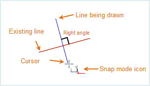
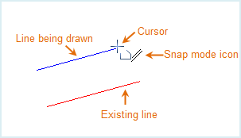
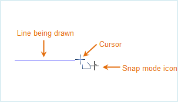
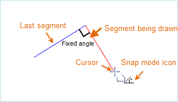
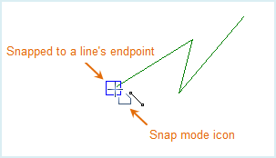
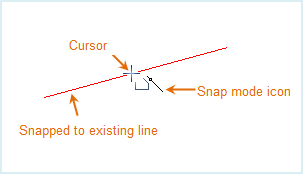
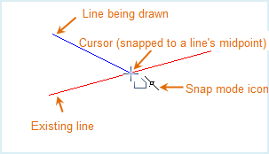
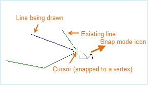

The snap modes are introduced below.

Icon | Description | Illustration  
---|---|---  
 | Make the current line segment perpendicular with the other linear element or its extension. Illustration: Drawing a line segment perpendicular with an existing one. |   
 | The current line segment is parallel to another line segment. Illustration: Drawing a line segment parallel to an existing one. |   
 | Make current drawing line horizontal or vertical. Illustration: Drawing a horizontal line. |   
 |Draw the current line segment in intersection with the point on other feature. Illustration: Drawing a line segment passing by an endpoint of another line segment. |   
 | Draw the current segment in a fixed length. Illustration: Drawing a line segment in a fixed length. |   
 | Draw the current line segment in a direction to make the angle between the segment and the previous one fixed. Illustration: Drawing a line segment 90 degrees from the former one.|   
 | Snap the drawing point to the endpoints or nodes of lines or border lines of polygons. Illustration: Snapping an endpoint of a line.|   
 | Snap a point of other feature which the horizontal or vertical line passing by the current mouse pointer also passes. Illustration: Positioning an endpoint of a line segment which the horizontal line passing by the current mouse pointer also passes.|   
 |Snap the drawing point to another line segment. Illustration: Snapping another line segment. |   
 | Snap the drawing point to the middle vertex of an existing line segment. Illustration: Snapping the middle vertex of a line.|   
 | Snap the drawing point to another point feature or vertex of other features Illustration: Snapping a vertex on another line.|   
 | Snap the drawing point to the prolonged line of an existing line segment Illustration: Snapping the extension of another line segment.|   