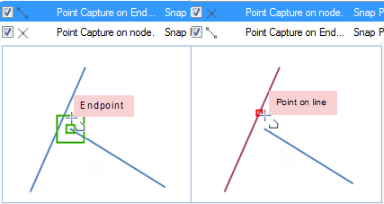
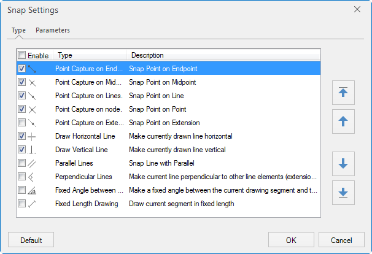
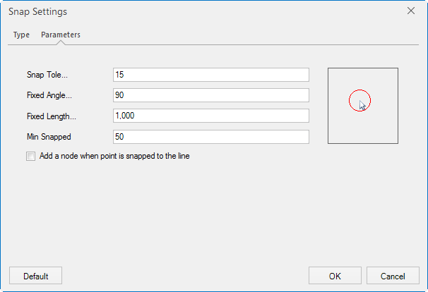

The Snap Settings can help establish exact locations in relation to other features. Snapping is conducive to your efficient object editing and mapping. You can choose the snap modes according to your needs. If snapping capability is enabled, the drawing node will be automatically snapped to edges, nodes, or other geometric objects within the tolerance.

In the Object Operations tab, click Snap Settings on the Object Operations group. The Snap Settings dialog box pops up.

### Types

  * The Types tab allows you to control which snap modes to use. 12 commonly used snap modes are listed in the box. For detailed information on these 12 snap modes, please refer to [Snap Modes](SnappIntrtoduct.htm). To enable a snap mode, check the box ahead.
  * Priority: Set the priority of the snapping modes in the list. Show as below, select one or more snapping types, you can use the up, down, top and bottom to change the priority. 
  
Figure: The priority of the snapping  

  * Enable: Select the Enable check box, representing enable all snapping modes; otherwise, disable all the snapping modes.
  * Default: Restore the default settings.
  
Figure: The snap modes  

# Parameters

The Parameters tab allows you to set relevant parameters for snapping. These parameters include: snapping tolerance, fixed angle, fixed length, maximum snapped count, minimum snapped length, and whether to add nodes.

  
Figure: The snap parameters  
  * Snapping Tolerance

The snapping tolerance ranges from 1 to 20 pixels and the default is 15. The value specified can not be out of the range. If the distance between an object and the cursor is less than the tolerance you set, the object will be snapped. 

  * Fixed Angle

The fixed angle ranges from 0 to 360 degrees and the default is 90. The value specified can not be out of the range. If the angle between the drawing line segment and the other one reaches the angle you set, the fixed angle icon shows up.

  * Fixed Length

The unit for the fixed length is the same with the map unit and the default is 1000. If the length of the drawing line equals the fixed length you set, the fixed length icon shows up.

  * Min Snapped Length

The min snapped length ranges from 1 to 120 pixels and the default is 15. If the value specified is beyond the range, you will be prompted to input a valid value. The minimum length of a line that can be snapped to. The line will not be snapped to if shorter than the specified min snapped length.

  * Add Vertex to Snapped Line

Check the box to break the line that is being snapped to.

  * Default

Click this button to restore to the default.

### Note

  * Snap Settings are a global setting and will be applied to all map windows. When you close the program, the last snap settings will be saved and used when you restart the program. 