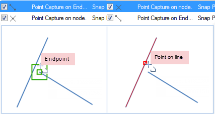
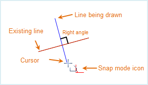
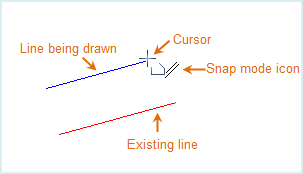
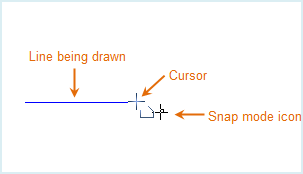
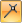
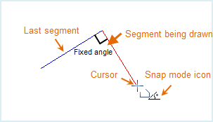
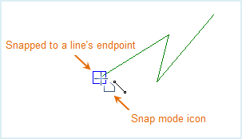
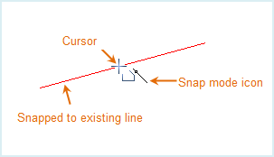
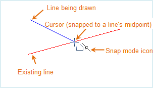
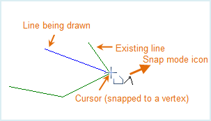

The snapping capability ensures the accuracy of object location. This section introduces how to enabling the snapping capability of a layer, how to snap, and the snap modes supported by SuperMap.

### How can we enable the Snap Feature

The feature controls the snappability of objects a vector layer.

**Basic Steps**

1. Right click on a vector layer in Layer Manager and select **Snappable**.
2. Or, right-click on a vector layer in the Layer Manager and select Layer Properties. In the popup Layer Properties panel, check **Snappable**.

**Note**

1. The Snappable icon button in front of a vector layer in the Layer Manager can also control the snap of the layer. A highlighted icon indicates that the layer is snappable.

2. An object in a vector layer can be snapped only when the layer is in an editable and snappable status.

### How does the Snap feature work?
The Snap Settings can help establish exact locations in relation to other features. Snapping is conducive to your efficient object editing and mapping. You can choose the snap modes according to your needs. If snapping capability is enabled, the drawing node will be automatically snapped to edges, nodes, or other geometric objects within the tolerance.

Click **Object Operations** tab **Object Operations** **Snap Settings** to open the **Snap Settings** dialog box.

#### Type

* The **Type** tab allows you to control which snap modes to use. 12
commonly used snap modes are listed in the box. For detailed information on
these 12 snap modes, please refer to [Snap Modes](SnappIntrtoduct). To
enable a snap mode, check the box ahead.

* Priority: Set the priority of the snapping modes in the list. Show as
below, select one or more snapping types, you can use the up, down, top and
bottom to change the priority.

  

* Enable: Select the Enable check box, representing enable all snapping modes; otherwise, disable all the snapping modes.

* Default: Restore the default settings.

  
 
#### Parameters

The Parameters tab allows you to set relevant parameters for snapping. These parameters include: snapping tolerance, fixed angle, fixed length, maximum snapped count, minimum snapped length, and whether to add nodes.

  

* Snapping Tolerance

The snapping tolerance ranges from 1 to 20 pixels and the default is 15. The value specified can not be out of the range. If the distance between an object and the cursor is less than the tolerance you set, the object will be snapped.

* Fixed Angle

The fixed angle ranges from 0 to 360 degrees and the default is 90. The value specified can not be out of the range. If the angle between the drawing line segment and the other one reaches the angle you set, the fixed angle icon shows up.

* Fixed Length

The unit for the fixed length is the same with the map unit and the default is 1000. If the length of the drawing line equals the fixed length you set, the fixed length icon shows up.

* Min Snapped Length

The min snapped length ranges from 1 to 120 pixels and the default is 15. If the value specified is beyond the range, you will be prompted to input a valid value. The minimum length of a line that can be snapped to. The line will not be snapped to if shorter than the specified min snapped length.

* Add Vertex to Snapped Line

Check the box to break the line that is being snapped to.

* Default
Click this button to restore to the default.

### Note

* Snap Settings are a gloal setting and will be applied to all map windows. When you close the program, the last snap settings will be saved and used when you restart the program.

### Supported Snapping Modes

The snap modes are introduced below.

Icon | Description | Illustration  
---|---|---  
 | Make the current line segment perpendicular with the other linear element or its extension. Illustration: Drawing a line segment perpendicular with an existing one. |   
 | The current line segment is parallel to another line segment. Illustration: Drawing a line segment parallel to an existing one. |   
 | Make current drawing line horizontal or vertical. Illustration: Drawing a horizontal line. |   
 | Draw the current line segment in intersection with the point on other feature. Illustration: Drawing a line segment passing by an endpoint of another line segment. |   
 | Draw the current segment in a fixed length. Illustration: Drawing a line segment in a fixed length. |   
 | Draw the current line segment in a direction to make the angle between the segment and the previous one fixed. Illustration: Drawing a line segment 90 degrees from the former one. |   
 | Snap the drawing point to the endpoints or nodes of lines or border lines of polygons. Illustration: Snapping an endpoint of a line. |   
 | Snap a point of other feature which the horizontal or vertical line passing by the current mouse pointer also passes. Illustration: Positioning an endpoint of a line segment which the horizontal line passing by the current mouse pointer also passes. |   
 | Snap the drawing point to another line segment. Illustration: Snapping another line segment. |   
 | Snap the drawing point to the middle vertex of an existing line segment. Illustration: Snapping the middle vertex of a line. |   
 | Snap the drawing point to another point feature or vertex of other features Illustration: Snapping a vertex on another line. |   
 | Snap the drawing point to the prolonged line of an existing line segment Illustration: Snapping the extension of another line segment. |   
