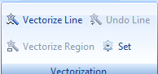

Before using this function, you need to understand the following questions:

  1. What is vectorization? 

The vectorization is a process converting raster data to vector data.

  2. Why interactive semi-automatic vectorization? 

Comparing with the raster data, the vector data has more compact structure, lower redundancy, higher quality and higher resolution graphical display, and it is conductive to network and retrieval analysis. Hence the raster data need to be vectorized for some analyses.

Currently, supports the function of interactive semi-automatic vectorization. The **Vectorize Raster** group on the **Object Operations** tab provides the functions such as vectorizing line and vectorizing region which are better for users to finish the vectorization of the raster data.

  
Figure: **Vectorize Raster** group  
  

Main functions:

[Raster to Vector Set](TraceSet.htm)

[Vectorize Line](TraceLine.htm)

[Undo Line](TraceLineBackoff.htm)

[Vectorize Region](TracePolygon.htm)
