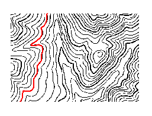

Before using this function, you need to understand the following questions:

* What is vectorization?

The vectorization is a process converting raster data to vector data.

* Why we need the interactive semi-automatic vectorization?

Comparing with the raster data, the vector data has more compact structure, lower redundancy, higher quality and higher resolution graphical display, and it is conductive to network and retrieval analysis. Hence the raster data need to be vectorized for some analyses.

Currently,supports the function of interactive semi-automatic vectorization. The **Vectorize Raster** group on the **Object Operations** tab provides the functions such as vectorizing line and vectorizing region which are better for users to finish the vectorization of the raster data.

### Raster Vectorization Settings

Preparations before the semi-automatic vectorization: Firstly, there must be
at least one registered raster base map; secondly, there must be at least one
vector dataset used to draw line or region; thirdly the raster base map must
overlay the vector dataset and they must be displayed in a window; finally,
the vector dataset must be the editable state, then the vectorization function
is active.

You need to set the parameters of vectorization before the interactive semi-
automatic vectorization.

**Basic Steps**
1. Click **Object Operations** **Raster to Vector** **Settings** to
open the **Raster to Vector** dialog box.

To use the **Vectorize Line/Region** feature, there is at least one editable
line, region, or CAD layer.

2. Set the parameters in the **Raster to Vector** dialog box:

* **Raster Layer** : Set the raster base map. You can select any
raster layer that needs to be vectorized in the drop-down list.

* **Background** : Set the background color for the raster base map.
The application will not trace the background color during vectorization. The
default background color is white.

* **Color Tolerance** : The degree of similarity of the raster base
map. It will continue tracing when any component value of RGB is less then the
tolerance. Its value range is from 0 to 255, and the default value is 32.

* **Filter Pixels** : Set the filter parameter, i.e., eliminates the
vertical offset distance that the serration of the line object flutters with
the grating method. The default value is 0.7. The greater the parameter, the
more points it filters.

* **Smoothness** : The vectorization needs the smooth operation. The
greater the smooth factor you set, the smoother the boundary of the vector
line/region is.

* **Auto Pan** : If the **Auto Pan** check box is checked, the
application will move the map automatically, i.e., the window will
automatically move when the mouse clicks the border of the window during
vectorization. If the **Auto Pan** check box is unchecked, the window has to
be moved manually.

3. Click **OK** to finish the settings and quit the dialog box. Click
**Cancel** to cancel all the settings and quit the dialog box.

**Note** : The settings that you set on the **Raster to Vector** dialog box will be saved automatically. When you open the dialog again, you can modify the parameters based on the saved settings. 

### Vectorize Line

Interactively vectorizes line objects on the raster base map.

**Basic Steps**

1. Click **Object Operations** **Raster to Vector** **Vectorize Line**.

2. Move the mouse to a line object and left-click to start to straw the line object.

3. When the mouse meets a breakpoint or a crossing during vectorization, the operation will stop and you need to double-click the next point on the forward direction line of the breakpoint or crossing. Then the tracing will go on until it meets another breakpoint or crossing.

4. Right-click when you meet an endpoint of a line segment to trace in a reverse direction from the start point.

5. Repeat Step 3 until you finish vectorizing a line.

6. Right-click to end vectorizing. If the raster line is closed, it will be closed automatically during vectorization.

* **Illustrations of Vectorization**

Descriptions | Illustration
---|---
1: Place your cursor on the raster line and left-click mouse to specify the first point and then begin to drawing the tracing. The tracing will stop when it reaches an endpoint, and you can double click the left key of your mouse to continue the operation. | 
2: Right-click to draw a line in a reverse direction from the start point. The vectorization stops when it reaches the other endpoint of the raster line. | 
3: Right-click again to finish vectorizing and get a line object. | 
* The quality of the raster base map influences the result of vectorization. You can use the **Undo Line** command to undo the drawing of partial line segments, and then left-click to do this, or right-click to return to the current vectorizing state.

* During vectorization, you can use Zoom In (Zoom Out, etc.) to adjust the scale of the raster base map. Right-click to continue vectorizing.

* Click **Esc** or click the **Vectorize Line** button on the **Vectorize Raster** group to cancel the current drawing.

* With Alt + Q shortcut keys, you can quickly and easily use the Vectorize Line function.

### Undo the Last Change

Before ending vectorization, the drawing state returns to the previously drawn position.

**Basic Steps**

1. Click **Object Operations** **Raster to Vector** **Undo Line**.

2. Move the mouse to the position where you are not satisfied. Click to undo the current mouse position.

3. Right-click to cancel Undo Line and return to the vectorizing state.

**Note**

* Only the Undo Line operation is being performed, the Undo Line function is applicable.

* With Alt + Z shortcut keys, you can quickly and easily use the Undo Line function.

### Vectorize Region

Perform the semi-automatic vectorization on the regions of the raster base map.

**Basic Steps**

1. Click **Object Operations** **Raster to Vector** **Vectorize Region**.

2. Move the mouse to a region object and left-click on it. Then the region object is drawn.

3. Use the same method to vectorize the other regions.

**Note** : With Alt + W shortcut keys, you can quickly and easily use the Vectorize Region function.

