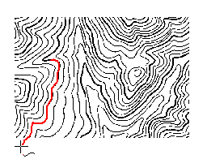
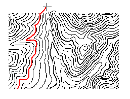
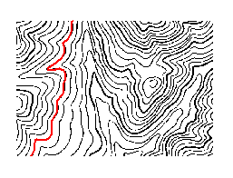

### Introduction

Interactively vectorize line objects on the raster base map.

### Basic Steps

  1. Click **Object Operations** > **Vectorize Raster** > **Vectorize Line** , then the **Raster to Vector** dialog box opens. After finishing the settings of vectorization, click **OK** to perform the operation. For more information, see [Raster to Vector Set](TraceSet.htm).
  2. Move the mouse to a line object and left-click on it to start drawing the line object.
  3. When the mouse meets a breakpoint or a crossing during vectorization, the operation will stop and you need to double-click the next point on the forward direction line of the breakpoint or crossing. Then the tracing will go on until it meets another breakpoint or crossing. 
  4. Right-click when you meet an endpoint of a line segment to trace in a reverse direction from the start point. 
  5. Repeat Step 3 until you finish vectorizing a line. 
  6. Right-click to end vectorizing. If the raster line is closed, it will be closed automatically during vectorization.

### Notes

  * **Illustrations of Vectorization**

 Descriptions | Diagrams  
---|---  
1: Place your cursor on the raster line and left-click mouse to specify the first point and then begin to drawing the tracing. The tracing will stop when it reaches an endpoint, and you can double click the left key of your mouse to continue the operation. |   
2: Right-click to draw a line in a reverse direction from the start point. The vectorization stops when it reaches the other endpoint of the raster line. |   
3: Right-click again to finish vectorizing and get a line object.|   
  * The quality of the raster base map influences the result of vectorization. You can use the **Undo Line** command to undo the drawing of partial line segments, and then left-click to do this, or right-click to return to the current vectorizing state. 
  * During vectorization, you can use Zoom In (Zoom Out, etc.) to adjust the scale of the raster base map. Right-click to continue vectorizing. 
  * Click **Esc** or click the **Vectorize Line** button on the **Vectorize Raster** group to cancel the current drawing. 
  * With Alt + Q shortcut keys, you can quickly and easily use the Vectorize Line function.