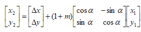
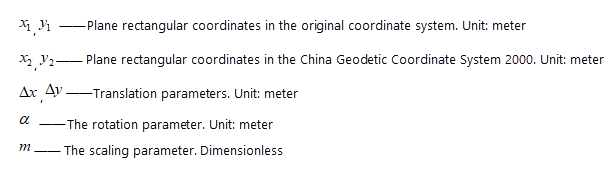

### Instructions

Converts a coordinate system to another coordinate system by setting four parameters (x-offset, y-offset, rotation and scale factor) and the target coordinate system.

**4-parameter transformation formula:** 

  
 
  
  
### Basic steps

  1. Select the dataset whose coordinate system will be converted, and click "Start" tab > "Data Processing" > "Projection Transformation" > "Four-parameters Transformation".
  2. In the Input area, specify the datasource and dataset as your need.
  3. In the Source Coordinate System, detail information of coordinate system of the input is shown including coordinate name, unit, projection parameters. 
  4. All required settings for converting an coordinate system to another coordinate system: 
    * Enter the values of the four parameters (X Offset, Y Offset, Rotation, Scale Factor(entering coefficient K, and then m=k/1000000)) in the "Four-parameter Settings" area.
    * Check the "Result Save As" to save the result into another dataset.
    * In the Target Coordinate System area, four ways are provided to set the target coordinate system.
      * **From Datasource** : Choose a datasource from the drop-down list and then the coordinate system of selected datasource will be adopted as the target coordinate system.
      * **From Dataset** : Choose a dataset from the drop-down list and then the coordinate system of selected dataset will be adopted as the target coordinate system.
      * **Projection Settings** : Click the "Settings" button to open the "Coordinate System Settings" dialog box where you can select a coordinate system as the target coordinate system. For detail operations, please refer to [Projection Settings](PrjCoordSysSettingWin.htm).
      * **Import Projection File** : Import a projection information file which can be a *.shp, *.prj, *.mif,*.tab, *.tif, *.img, *.sit, or *.xml file.
      * **Coordinate Information** : The detail parameter information of target coordinate system is shown on this area.
  5. Click "Convert" to perform the operation. The conversion result can be viewed on the "Output Window".