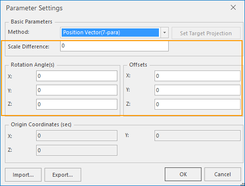

### Introduction

Transforming the coordinate system for a dataset, the vector data result will be saved as another dataset, or transform the original dataset projection directly; Raster, image or model dataset result will be saved as a new dataset.

### Basic Steps

  1. Click Start > Data Processing > Projection Transformation > Dataset Projection Transformation to open the Dataset Projection Transform dialog. 
  2. In Input area, sets the source datasource and dataset to be converted.
  3. Source Coordinate System: Shows the detailed information of the source dataset coordinates.
  4. Method: The method drop-down menu list shows more than ten kinds of projection conversion methods, you can choose a suitable projection conversion method. For the description of the conversion method, please refer to [the reference system conversion method](PrjConvertMethods.htm). 

**Note** : The conversion can happen between any two plane coordinate systems
(including planar coordinate systems and projection coordinate systems) with
the four-parameter method. The transformation between a planar coordinate
system and a geographic coordinate system is not allowed.

  5. Projection Transformation: different conversion methods correspond to different customized parameters. 
    * The three parameter conversion method, such as Geocentric Translation, Molodensky or Molodensky Abridged.
You need to set three translation parameters, namely (ΔX, ΔY, ΔZ). Such
conversion is essentially a kind of earth center transformation, from a datum
center (0,0,0) to another datum center (ΔX, ΔY, ΔZ). The three parameter
transformation is linear transformation, the unit is meter.

    * The seven parameter conversion method, such as Position Vector, Coordinate Frame or Bursa-wolf, the "Transform Projection" dialog box is as shown below:    
---  
You need to set seven parameters, namely three linear translation parameters
(X, Y, Z) in meter, three rotation angle parameters around axis (Rx, Ry and
Rz) in arc sec and the scale difference (s). The scale difference is 1/1000000
(PPM).

  6. Import/export the projection conversion parameters file: click the  button to import a *.ctp projection conversion parameters file for the conversion use. Click the  button to export the current conversion parameters to a file.
  7. In the Result Save As area, specify the resulting dataset's name and a datasource to save it.
  8. The settings of the target coordinate system support three ways: 
    * Reset Coordinate System: Click on the icon  and select More... in the drop-down list to open the Coordinate System Settings dialog box where you can specify a target coordinate system. For more detail operations, please refer to [Projection Settings](PrjCoordSysSettingWin.htm).
    * Copy Coordinate System: Click on the icon  to open the dialog box Copy Coordinate System where you can specify that target coordinate system is the same as either a datasource or a dataset..
      * From Datasource: set the datasource coordinate system as the target coordinate system. 
      * From Dataset: Select a dataset, then the coordinate system adopted by the dataset will be taken as the target dataset.
    * Import Coordinate System: Click on the Import Coordinate System icon button and browse to the projection information file to import it. It supports to import shape projection information file (*.shp; Prj), MapInfo exchange format (*.mif) MapInfo TAB file (*.tab), image format projection information file (*.tif; *.img; *.sit), projection information file (*.xml). 
  9. Model Convert Vertex: It is available when the source data is a model dataset. To a model dataset, the box is checked by default to avoid the position of every converted object wrong. 

* Click Convert to finish. Users can view the result in the output window.

### Note

  1. Any projection has a projection distortion, so the transformation of different projection process is usually not completely reversible, that is, the map data from its original projection to some other projection, but not always very accurate to convert it back, so the original data should be kept. To reduce the number of projection transformation, the accuracy of the results is also reduced. 
  2. Each projection is designed to reduce the deformation of a given area in a given characteristic, so it is not suitable for all areas. It is needed to choose the suitable transformation method. For example, from Mercator projection to Gauss projection, the result's accuracy can only be guaranteed in the region near the central meridian, and the areas far from the central meridian will lead to great deformation.
  3. In the actual work, what kind of method to use depends on the specific circumstances. For the determination of all parameters, please buy the correct mapping data, or verify the correctness of the parameters with the coordinates of the known control points in the two coordinate system.
  4. After converting the text object, the height and angle will be converted. If users don't need these changes, they should modify the height and angle.
