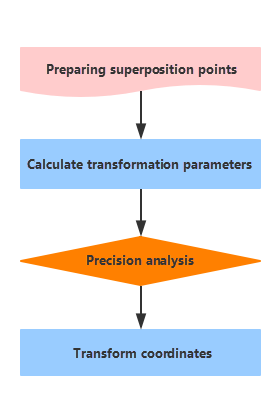

  

Commonly used coordinate systems in China are: Beijing Geodetic Coordinate System l954, Xi'an Geodetic Coordinate System 1980, World Geodetic System-1984 Coordinate System and China Geodetic Coordinate System 2000. Following table list relative parameters:

Coordinate system  | Reference ellipsoid | Semi-major axis | Flattening  
---|---|---|---  
Beijing Geodetic Coordinate System l954 | Krasovsky | 6378245 | 1: 298.3  
Xi'an Geodetic Coordinate System 1980 | IAG-75 ellipsoid | 6378140 | 1: 298.257  
WGS 84 | WGS 84 | 6378137 | 1: 298.257223563  
China Geodetic Coordinate System 2000 | CGCS2000 | 6378137 | 1: 298.257222101  

Because of all coordinate systems are based on different reference ellipsoids 
or different geodetic datums, a point on the Earth has different coordinate 
values on different coordinate system. When converting or transforming from 
one coordinate system to another, you must to know about whether a conversion 
will be happened among the same reference ellipsoid or a transformation will 
be done from one reference ellipsoid to another. For example, both Geodetic 
Coordinate of Beijing Coordinate System l954 and Plane Rectangular Coordinate 
of Beijing Coordinate System l954 are based on the same reference ellipsoid, 
hence the conversion between them is rigorous. However, Beijing Coordinate 
System l954 and China Geodetic Coordinate System 2000 are based on different 
reference ellipsoids, the translation between them is imprecise without a set 
of certain parameters being used. So, the transformation models are necessary, 
and you need to get the transformation parameters through transforming datums, 
and then perform the coordinate conversion based on the same datum.

### Technology Process of Coordinate Conversion

  
---  
  1. **Preparation** : Gather and organize all data for converting or transforming, and then pick up the superposition points which should be reliable, high-precision, and even-distributed to cover all areas. 
  2. **Transformation parameters** : According to the obtained superposition points and transformation conditions, determine the transformation model. For the redundant coincident points, take the least square method as the constraint condition. 
  3. **Precision Analysis** : According to the transformation parameters, calculate target coordinates of superposition points and then analyze the transformation residuals which are the differences between the calculated coordinates and the actually given coordinates. With the transformation residuals, calculate errors thereby assess the coordinate transformation precision. Based on the error tolerance (3 times of error) determine which superposition points can not be adopted and should be abandoned. 
  4. **Coordinate system transformation** : Calculate target coordinates of other features according to the final qualified parameters.

**Note** : Maybe you want to know following questions before performing the transformation.

  1. [**How to select superposition points?**](TransformationParaStep.htm#1)
  2. [**How to select the transformation model?**](TransformationModel.htm)

