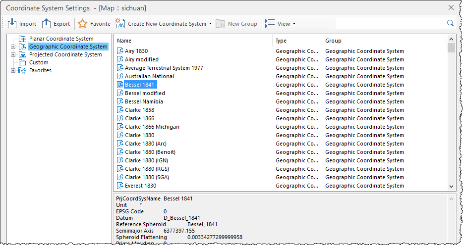

### Instructions

The Projection Settings dialog box allows you to set the geographic projection of your datasource, dataset or map.

### Basic Steps

Most of the commonly used geographic coordinate systems are provided. You can
choose a predefined geographic coordinate system or customize your own
geographic coordinate system to meet your needs.

1. Click **Projection Settings** > **Projection Settings...** to open the **Coordinate System Settings** dialog box.
2. Click the **Geographic Coordinate System** node and all provided coordinate system information are listed at right. You can directly select a coordinate system or input characters in Search box to locate related coordinate systems. 

3. You can customize a coordinate system, for details, please refer to [New a geographic coordinate system](NewGeoCoordSys). 
4. Click "Apply" to apply to your datasource, dataset or map. 

