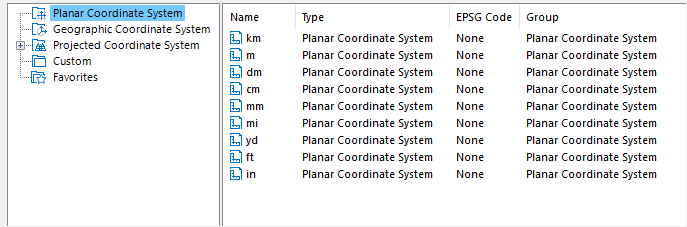

### Instructions

The Coordinate System Settings dialog box allows you to set the projected projection for the selected datasource, dataset or map.

### Basic Steps

1. Click "Projection Settings", and then click "Projection Settings" in the drop-down list to open the "Coordinate System Settings" dialog box.
2. Select Planar Coordinate System on the left.

3. On the right of the window, you can change the unit of the planar coordinate system. Or you can set the coordinate information for the selected datasource or dataset. For more details, please refer to [Projection Settings Window](PrjCoordSysSettingWin). 
4. Click "Apply" to apply to your datasource, dataset or map.

