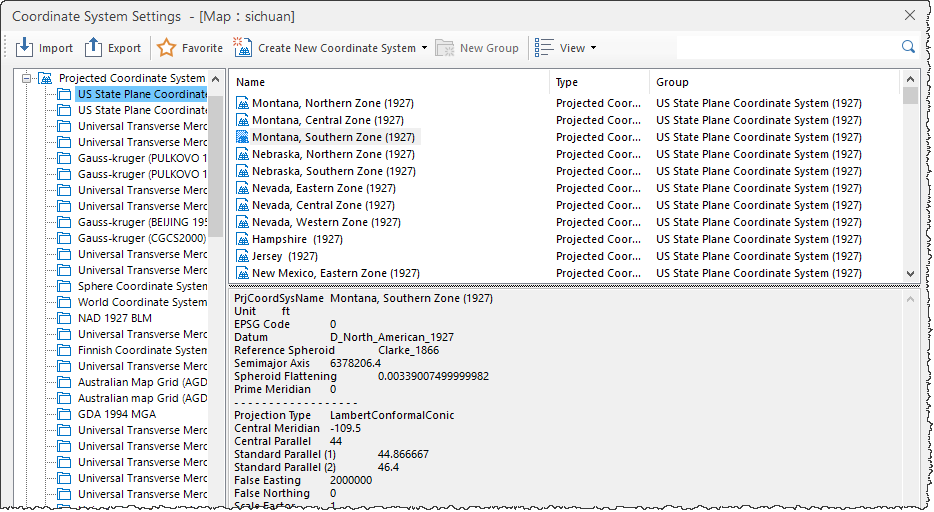

### Instructions

The Projection Settings dialog box allows you to set the projected coordinate
system of your datasource, dataset or map.

### Basic Steps

Most of the commonly used projected coordinate systems are provided. You can
choose a predefined projected coordinate system or customize your own
projected coordinate system to meet your needs.

1. Click "Projection Settings", and then click "Projection Settings" in the drop-down list to open the "Coordinate System Settings" dialog box.
2. Click "Projected Coordinate System" node and all provided coordinate system information are listed at right. You can directly select a coordinate system or input characters in Search box to locate related coordinate systems. 

3. You can customize a projected coordinate system, for details, please refer to [New a projected coordinate system](NewProCoordSys). 
4. Click "Apply" to apply to your datasource, dataset or map. 

