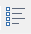

---
id: PrjCoordSysSettingWin
title: Projection Settings
---  

### Instructions

The Projection Settings window is used for setting, managing and customizing the projection information of your datasources, datasets, and maps. The window consists of the function area, the directory tree, the projection lists and the description area.
  
### Feature area

Menu tool bar and Retrieve are provided at the top of dialog box.

  1. **Import** : Click  button to open "Import Coordinate System" dialog box where you can specify your file.

7 types of projection files are supported: Image format(*.tif, *.sit, *.img),
Shape file(*.shp, *.prj), MapInfo Exchange Format(*.mif) , MapInfo TAB(*.tab)
, Coordinate file(*.xml)

  2. **Export** : Click  to open "Browse Folder" dialog box where you can select a destination to save coordinate files, and then click "OK" button to finalize the operation.

Importing one or more coordinate files/folders at the same time is allowed.

  3. **Favorites** : You can add some commonly used projection files to Favorites. Also you can add groups in Favorites to manage or export projection files conveniently. 
  * Select a coordinate system file, then click  Favorite button and "Add to Favorites" dialog box appears.
  * The favorite file is saved in the default folder by default, also you can click "New Folder" to create a new folder to save your favorite and set your favorite's name in "Name" box. 
  * Click "Add" button to finish the operation.
  * Your favorites will be listed in the drop-down list of "Projection Settings".
  * All your favorites will be saved under the path Installation Directory\Templates\Projection\MyFavorite\\.
  4. **New Coordinate System** : You are allowed to create [Geographic Coordinate System](NewGeoCoordSys.htm) and [Projected Coordinate System](NewProCoordSys.htm), also you can create [a coordinate system based on EPSG code](NewGEPSGCoordSys.htm). Also you can copy or modify existed files. New coordinate systems are saved in the Custom directory by default. 
  5. **New Group** : Click  button in the tool bar to create a group named "NewGroup" under the directory where the selected file is located in.
  6. **View** : Control the style of icons in file list area of current dialog window. Four types are supported, you can click button in  drop-down list box to switch styles for icons.
  7. **Search** : Inputting part/whole characters of name of file you want to search to help you to find the file quickly. Also you can type the value of EPSG Code to search. 

### Directory tree

All groups of your coordinate system files all listed in here. You can click a folder node to display all files under the folder, for example you click "Favorites" and all favorite files you added will be listed at right.

### List area of files

Browse, set and manage configuration files of coordinate system. The contents of list are different when you select different group.

### Display area of description information

Mainly display decription information of coordinate system files.

  * If you select a coordinate system file, detail information of the file will be shown on the description area.
  * If you select a folder in the directory tree, the folder's name and number of objects in the folder are shown on the description area.

### Features in the right-click menu

The right-click menu comprises 12 features. Which features work depends on the
node you select. These features are introduced in detail as follows:

  * **Copy** : Copy the selected file.
  * **Paste** : Paste your copied coordinate system file(s) to current file list. Please make sure that there are not any files being selected in current file list before doing the operation. 
  * **Locate** : The locate feature can help you to know which group the selected file belongs to.
  * **View** : Control styles of all icons in current file list. For details, please refer to View.
  * **New Group** : Create a new folder named "NewGroup" under the "Custom"or "Favorites" node. 
  * **New Coordinate System** : Creating Geographic Coordinate Systems, Projected Coordinate Systems, and Coordinate System based on EPSG code. All new generated files are saved under "Custom".
  * **Modify** : Modify the settings of parameters of coordinate systems.
  * **Rename** : Rename nodes or files under "Custom" or "Favorites".
  * **Delete** : Delete nodes or files under "Custom" or "Favorites".
  * **Import Coordinate System** : Importing coordiante system files under the "Custom" node is supported. Click Import for more details.
  * **Export Coordinate System** : Export the selected files to a specified destination, for more details, please refer to Export.
  * **Favorite** : Add selected files or folders to Favorites, for more details, please refer to "Favorites" in feature area.

### Related topics

 [New Geographic Coordinate Systems](NewGeoCoordSys.htm)

 [New Projected Coordinate Systems](NewProCoordSys.htm)

 [Create Coordinate Systems by EPSG encoding](NewGEPSGCoordSys.htm)