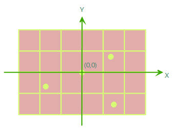
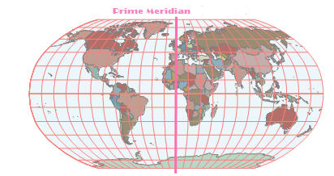

---
id: PrjCoordSysType
title: SuperMap Coordinate Systems
---  

In SuperMap, there are three types of coordinate systems: planar coordinate systems, geographic coordinate systems, and projected coordinate systems.

### [Planar Coordinate System](PlaneCoordSysDia)

It is generally used as the coordinate reference of data that is irrelative to
geographical location, and is also the default coordinate reference of new
data. For example, CAD files, scanned picture of a paper map, a sketch map
that is irrelative to geographical location. Planar Coordinate System is a
two-dimensional system. The coordinate of its origin is (0, 0), and the 
coordinate of other points can be measured by the vertical distance from the 
point to X and Y axis.

  

  
### [Geographic Coordinate System](GeoCoordSysDia)

It uses longitude and latitude to denote any location on earth spheroid. In
Geographic Coordinate System, the definitions of datum, prime meridian and
units of angle are usually included. WGS 84, Beijing 1954, Clarke1866 are
commonly-used Geographic Coordinate System. Many data, such as KML data of
Google Earth and GPS data, employ WGS84 as coordinate reference. In China the
coordinates of control points from geodetic survey use Xi'an 80 or Beijing
1954 as coordinate system. Below is a map of the world that uses WGS 84 as
coordinate system.

  
  
### [Projected Coordinate System](PrjCoordSysDia)

It uses various projection types to make any location on earth spheroid
projected onto a plane. It uses two-dimensional Planar Coordinate System to
denote the locations of point, line and region features. In projected
Coordinate System, the definitions of Geographic Coordinate System, map
projection, projection parameters and units of distance are usually included.
Gauss-Kruger, Albers, Lambert and Robinson are commonly-used Projected
Coordinate System. Generally, projected geographic data can be used in
measurement, spatial analysis and mapping etc. For example, the basic scale
topography map of China uses Lambert projection on the scale 1:1 million and
most of others use Gauss-Kruger Projection with three-degree zone or six-
degree zone. In urban planning, large scale maps, such as road construction
map and architecture design map with the scale of 1:500 or 1:1000, often use
Planar Coordinate System. Below is a map of the world that has been projected
from WGS 84 to Robinson Projection.  

  
