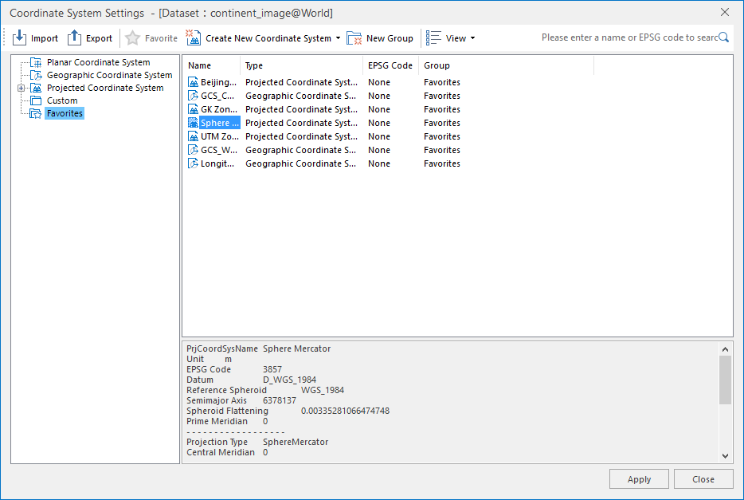

### Instructions

divides all coordiante systems into three classes: planar coordinate systems,
geographic coordinate systems, and projected coordinate systems. You are
allowed to set different types of coordinate systems for datasources or
datasets according to needs.

The Projection Set command in the Data Processing group which is in the Start
tab allows you to set the projection for the datasource or dataset in the
workspace.

The Set command is only active if there are selected datasources or datasets
in the workspace. The Set buttonDropDown appears in two parts: the image part
and the text part with a drop-down arrow. You can click the image part to
directly open the Projection Settings window, or click the drop-down arrow to
select a projection from My Favorites list. For more information on My
Favorites list for projections, please refer to the introduction to the
[Projection Settings - Favorites](PrjCoordSysSettingWin#6) in the
Function Area in the Projection Settings window. The drop-down list will be
empty if there are no projections added to Favorites.

### Basic Steps

In the Workspace Manager, select the datasource or dataset for which you want
to transform the projection, click Set in the Projection group to display the
Projection Settings window. If you have selected several datasources or
datasets, the Projection Settings window pops up for the projection setting of
the last selected datasource or dataset. The Projection Settings window may
vary depending on the coordinate system type of the last selected datasource
or dataset. Your last selected datasource or dataset may be in:

  

  
### Note

You can locate the search box through the shortcut key Ctrl+F/Ctrl+F3.

### [Setting Planar Coordinate System](PlaneCoordSysDia)

### [Setting Geographic Coordinate System](GeoCoordSysDia)

### [Setting Projected Coordinate System](PrjCoordSysDia)

  

