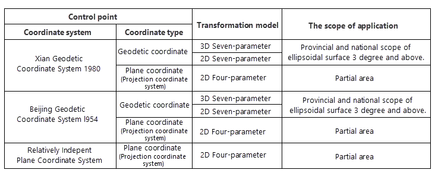
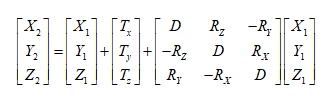
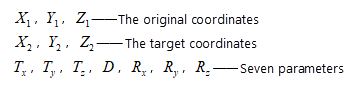
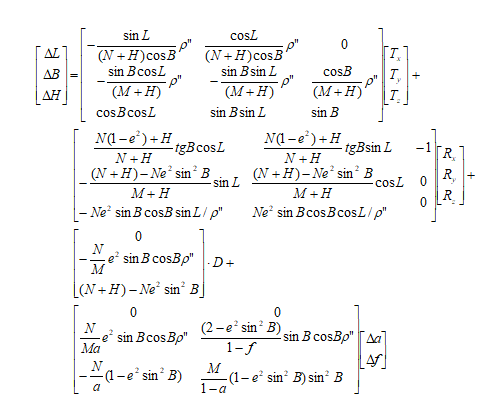
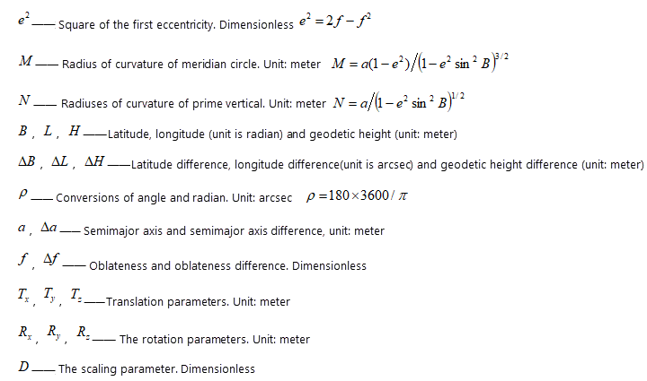
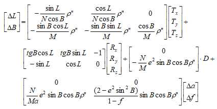
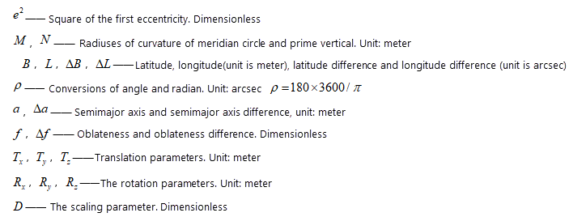

  

Transformation models supported by  include **Position Vector(7-para), Coordinate Frame (7-para), China_3D_7P(7-para), China_2D_7P(7-para), and China_2D_4P(4-para)**.

###  About transformation models

* **Position Vector( 7-para), Coordinate Frame (7-para)** : Both of the two models are seven-parameter transformation (or Bursa Model) composed of three translations, three rotations and one scale. The two models can be considered as one model except for the definition standard to negative or positive.
  * Position Vector is defined by Europe and the counter clockwise is negative.
  * Coordinate Frame is defined by America and Australia and the counter clockwise is positive.
* **China_3D_7P(7-para)** : the model is used for the translation among geodetic coordinate systems based on different ellipsoid datums. Besides the seven parameters, the semi major axes of reference ellipsoids and the flattening differences between them should be taken into consideration.
* **China_2D_7P(7-para)** : the model is used for the translation from the geocentric coordinate system to the geodetic coordinate system based on different ellipsoid datums.
* **China_2D_4P(4-para)** : The four parameter conversion model is used for the translation among different Gaussian projection plane coordinates. Four parameters are needed(two translations, one scale and one rotation). For a 3D coordinate, you need to obtain the relative plane coordinate through Gaussian projection and then calculate the required parameters.

###  Applicable range

The selection of transformation model is influenced by control points and translated area, so you can refer to the application range of each transformation model given by your country to select an appropriate transformation model.

* **Position Vector( 7-para), Coordinate Frame (7-para)** : They are applicable to provincial and national control point space rectangular coordinate conversion.
* **China_3D_7P(7-para)** : Applicable to the provincial and national control point coordinate conversion of ellipsoidal surface 3 degree and above.
* **China_2D_7P(7-para)** : It is applicable to the provincial and national control point coordinate conversion of ellipsoidal surface 3 degree and above.
* **China_2D_4P(4-para)** : It is suitable for small-scale control point plane coordinate conversion, constructing the relationship between relatively independent plane coordinate system and China Geodetic Coordinate System 2000.

The following table shows how to select transformation models and the applicable scope. (This table only shows models that apply to the transformation from other coordinate system to the China geodetic coordinate system 2000)

  
  
**Application scenarios**

iDesktop can transform any coordinate system to China geodetic coordinate
system 2000 without the help of any plugin.

* If a coordinate system derived from a general coordinate system (such as Xian1980 or Beijing1954). To make the coordinate transformation successful, iDesktop can transform the coordinate system to the corresponding general coordinate system, then to the China Geodetic Coordinate System 2000.

**First, perform the transformation from the coordinate system to the general
coordinate system.** Please use the feature [Dataset Projection
Transformation](ConvertPrjCoordSysSingle.htm) and set the transformation
Method to China_2D_4P (4-para).

**Second, perform the transformation from the general coordinate system to
China Geodetic Coordinate System 2000.** You can use the feature [Calculate
Transformation Paramters](TransformationParaStep.htm) to obtain the required
parameters' values, and then use the feature [Dataset Projection
Transformation](ConvertPrjCoordSysSingle.htm) and select an appropriate
transformation model to finish the transformation.

* If the coordinate system is based on the real coordinate system of some projection zone, you can finish the transformation by the second step directly.

###  Model equations

* **Position Vector(7-para), Coordinate Frame (7-para)**

  
---  
  

 * **China_3D_7P(7-para)**

  
---  
  

* **China_2D_7P(7-para)**

  
---  
  

* **China_2D_4P(4-para)**

  
---  
  
  
### Note

If your data adopted the transverse Mercator projection coordinate system, please notice that the X-axis and Y-axis are the opposite of the coordinate axes in iDesktop.