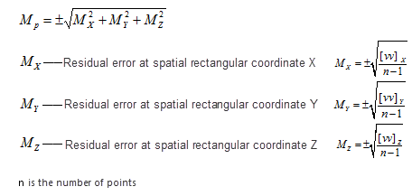

### Instructions

To perform coordinate conversion or coordinate transformation, the commonly used four parameters or seven parameters are required.  can calculate these parameters through a series operations including: pick up superposition points, transformation models, assess precision and so on.

  * **Instance** : Following steps illustrate how to transform the coordinate system of vector data of an area from Xi'an Geodetic Coordinate System 1980 to China Geodetic Coordinate System 2000.
  * **Preparations** : Select some control points as a superposition file.
  * Choosing **superposition points** is very critical, and coordinates of control points which can be considered as superposition points must be given both in two coordinate systems.
    * **Basic principles of choosing superposition points are** : high level, high accuracy, even distribution, covering the whole area, less distorting.
    * **Number of superposition points** : Generally, the number can not be less than 6 and the number of external checking points can not be less than 6 too. The points must be distributed evenly and cover the whole area. In consideration of the existence of gross errors, you should prepare more superposition points as much as possible. 

  
Figure: Superposition points  
  
### Basic steps

    1. Open your datasource, click "Start" tab > "Data Processing" group > "Project Transformation" drop-down button > "Calculate Transformation Parameters" to open the "Calculate Transformation Parameters" dialog box.  
    2. **Model Settings** : Click on the drop-down button, then choose a transformation model. Five transformation models are provided including Position Vector(7-para), Position Vector(7-para), China_3D_7P(7-para), China_2D_7P(7-para), and China_2D_4P(7-para)**. 

Which transformation model should be chosen depends on the specific situation. For detail transformation models and their scopes, please refer to [Transformation model](TransformationModel.htm).

    3. **Coordinate Type** : Specify the original coordinate system and the target coordinate system. The supportive types are: geographic coordinate system and projection coordinate system.
  * **Source Coordinate System** : Set the original coordinate system through two ways: 
    * **Projection Settings** : Click the "Settings" button to open the "Coordinate System Settings" dialog box, and then choose the coordinate system of your data.
    * **Import Projection File** : Click the icon to open the "Select" dialog box and then select the projection file.
    * **Target Coordinate System** : Specify the target coordinate system as specifying the source coordinate system.
    4. **Superposition Point Settings** : Select the points which have coordinates both in two coordinate system as superposition points. The formats of superposition points must be consistent with the formats of the original and the target coordinate systems. 

Two ways are provided to add superposition points:

      * Click the icon  to import the superposition point file (.txt). 

Format references of superposition point file (.txt)

  
---  
Figure: Superposition point file  
  
      * Click the Import button to enter coordinates of superposition points manually.

All information of superposition points imported are listed, you can check the
corresponding checkbox to specify which point will be invovled in the
calculation. Note: at least 6 pairs of points are checked.

  
---  
    5. **Calculate transformation parameters** : Click "Calculate" button to perform the calculation. 
      1. The transformation parameters including **Offset X, Offset Y, Offset Z, Rotation X, Rotation Y, Rotation Z and scale difference** are obtained by using the least square method.
      2. According to whether the coordinate residual (Dx, Dy, DH) of superposition points is larger than triple the point error determines a pair of superposition points are available. In the column Usable, Yes means the corresponding points are available. 

Note: You can remove the unusable points or set these points unavailable to
improve the accuracy.

  
---  
  
Correlation error calculation formulas

  * Superposition point residual (Dx, Dy, DH) = The calculated coordinates - the given coordinates
  * The formulas for calculating errors on points:  
        

  * The formulas for calculating errors on points in plane: 
      
    

    6. **Calibrate** : The superposition points (whose number must be equal or more than 6 and distributed evenly) that do not participate in the calculation of the conversion parameters are used as external check points, according to the errors in residuals assesses transformation precision by adopting the inner precision and the outer precision. and only the points where the residuals are less than 3 times of errors meet requirements. 
    7. **Import transformation parameters** : Click the  icon in the "Coordinate Transformation Parameters" area to import the transformation parameters as a transformation parameter file (*.ctp).
    8. In the **Parameter Settings** dialog box import required transformation parameters by importing the file(*.ctp) to transform your data from the original coordinate system to the target coordinate system. For specific operations, please refer to [Transform dataset projection](ConvertPrjCoordSysSingle.htm).

Following pictures show the comparison between the original dataset and the result dataset.

  
Figure: The comparison before and after converting data  