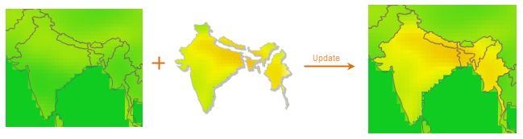

### Introduction

Updates a raster dataset with another raster dataset(s).

The left figure shows data to be updated. The middle figure shows a group of
raster data to update the target data. The right figure shows the result data.

The required raster data should meet the following requirements:

1. Pixel formats of both the target dataset and the update dataset should be the same;
2. The two raster datasets must have overlap parts.

### Function Entrances

* Click **Data** > **Data Processing** > **Raster** > **Data Update**.
* **Toolbox** > **Data Processing** > **Raster** > **Data Update**. (iDesktopX)

### Parameter Description

In the Raster Update/Splice dialog box, set the following parameters:

* **Source Data** : the source data area contains list box and tool bar.

* The toolbar contains a series of commands to add, delete, select, and sort datasets.
* The list area will list all datasets to update the input according to their order.
* **Target Data** : 
* **Data Update** updates data to the existing raster/image dataset. In the **Target Data** area, specify the target dataset.
* **New Dataset** : check the checkbox, iDesktop will create a new dataset which is the combination of all source data. For specific information, please refer to [Raster Splice](RasterSplice).

### Note

When updating image data, if the encode mode of the source data used is DCT,
the result will has deckle edge. It is because the DCT encode type is a lossy
compression, and the boundary value of the image will be changed after the
encoding. For the introduction of dataset encoding, see [Encoding Modes for
Dataset Compression](../DataManagement/EncodeType). When using the data
updating functionality, it is not recommended to use the image with DCT
encoding, to avoid the deckle edge problem.

