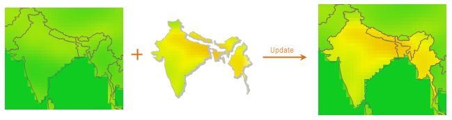

### Introduction

Update a part of a raster dataset by using the corresponding content of another dataset.

The figure below shows the example of update data in batch: The figure on the left shows the data to update, that is the target data, the figure in the middle shows a group of raster datasets, which are used to update the content in the corresponding location in the target data, the figure on the right shows the result after the updating.

  
---  
  
The data used should meet the following requirements:

  1. The pixel format of the target dataset and the update dataset should be the same;
  2. The two raster dataset must have overlap parts.

### Basic Steps

  1. In the Data Processing of "Data" tab, click the Data Update button in the Raster group.
  2. Users should set the following parameters. 

**Target data**

The raster data to be updated in the current workspace. After the target data is confirmed and begin to add dataset in the datasource list box below, the target datasource and the target dataset will become gray and can't be changed.

  * Target datasource: In the dropdown list on the left, it lists all the datasource in the current workspace.
  * Target dataset: In the dropdown list on the right, it lists all the datasets in the selected datasource, select the dataset to update in it.

**Source Data**

The data source part contains list box and tool bar. The list box displays one or more raster/image dataset used to update the target dataset.

  * Source Dataset: The raster/image dataset used to update the target data.
  * Source Datasource: The datasource which contains the source dataset.
  * Result: After click "OK" button to perform the updating operation, the result column will be display in the list box, the column will display whether the source dataset is updated to the target data by the operation order. The data is updated form the bottom to the top.

Also, you can use the tool buttons to the right of the list box to add, delete, select or order the source datasets.

Instruction for Toolbar Button

  * : Click Add button, the Select dialog box appears, you can select the raster dataset as the update data in it. The type of the dataset displayed in the dialog box is the same with the target dataset (raster dataset or image dataset).
  * : Click Remove button to remove one or more records selected in the list box.
  * : Click Select All button to select all the records in the list box.
  * : Click Select inverse button, the records not selected will be selected, and the selected records will become not selected.
  * : Move the record upward.
  * : Move the record downward.

  3. Close when finished: When checked, the Update dialog box will be closed automatically after the updating operation finished.

### Note

When update image data, if the encode mode of the source data used is DCT, the result will has deckle edge. It is because the DCT encode type is a lossy compression, and the boundary value of the image will be changed after the encoding. For the introduction of dataset encoding, see [Encoding Modes for Dataset Compression](../DataManagement/EncodeType.htm). When using the data updating functionality, it is not recommended to use the image with DCT encoding, to avoid the deckle edge problem.