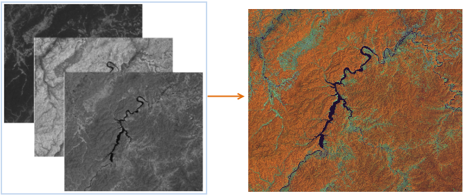

### Introduction

It is to combine three single band image data into a RGB image. Users can choose the best band according to the needs for combining to improve the image display speed and accuracy. Based on the additive color synthesis principle, the function assigns respectively Red, Green and Blue color for synthesis according to three remote sensing images.

Using different bands for synthesis, the result will highlight different features. Take the 7 bands of the TM image as an example:

  * 321 band: that is true color synthesis, the band 3, 2, and 1 are given red, green, blue, to obtain a natural color composite image. The color of the image is consistent with the actual scene. It is suitable for shallow water exploration and mapping, at the same time, it is suitable for non remote sensing application professionals.
  * 432 band: standard false color synthesis, the band 4, 3, 2 are given red, green, blue, and the vegetation appears red, so that it can highlight the characteristics of vegetation, often used in vegetation information extraction. It is the most commonly used band combination in vegetation, crop, land use and wetland analysis.
  * 453 band: the most informative combination. In the TM data, the band 5 is the most informative. The band 4, 5, 3 are given red, green and blue to make the color contrast is very obvious, and the color display rule of various types of features is similar to the conventional synthesis image, commonly used in visual interpretation, but also applied to determine the boundary of the land and water.
  * 741 band: the band combination image is compatible with middle infrared, near infrared and visible spectral band information, and the color information is rich. It has abundant geological information and earth environmental information, and there is no much interference information, geological interpretation level is high, it can display various structural features (folds and faults) clearly, and it can display different types of rocks with clear boundary.

### Basic Steps

  1. Click Data tab > Data Processing group > Image Compositing, pop up the setting dialog.
  2. Red: Set a dataset. The dataset will be loaded through the red channel, rendering with the base color as red.
  3. Green: Set a dataset. The dataset will be loaded through the green channel, rendering with the base color as green.
  4. Blue: Set a dataset. The dataset will be loaded through the blue channel, rendering with the base color as blue.
  5. Set the result dataset. 
    * Datasource: select the datasource to save the result dataset, the default is the same one the single band dataset is in.
    * Dataset: set the result dataset name.
  6. After setting, click OK to start the operation.
  
  
Compositing Result of 453 Band  

