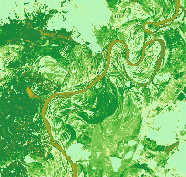
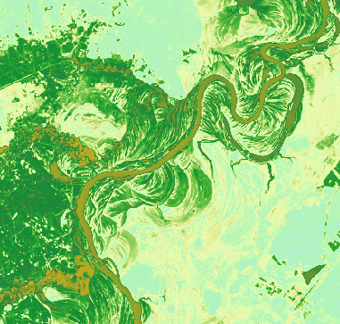

### Function description

Calculates the NDVI index based on band information of image data to extract an index of vegetation and NDVI to extract water information.

  * **NDVI**

NDVI (Normalized Difference Vegetation Index) can extract vegetation from water and soil. It can reflect the variation of vegetation-covered area. It is the best indicator to growth state and coverage of vegetation. NDVI, acquired by satellite images like SPOT/VEGETATION and MODIS, can be used in vegetation monitoring, land use, vegetation variation detection, Herbage yield assessing, drought monitoring, and so on.

NDVI ranges from -1 to 1.

    * **Negative value** means surface features are things that has high reflection to visible light like water, snow, and cloud.
    * **0** indicates there are rocks or bare soil. NIP is equal to R approximately.
    * **Positive value** denotes there is vegetation. The greater the value, the greater the vegetation coverage.

  * **NDWI**

Generally, NDWI (Normalized Difference Water Index) is used to extract water information from images. Compared to NDVI, NDWI can obtain moisture content within the vegetation canopy. NDWI can respond to moisture content stress, which has significant meanings to drought monitoring. But NDWI can't work well in the extraction of water with much more buildings like cities. Data having a value greater than 0.2 is water data.

### Function entrances

Click Data tab > Data Processing > NDVI/NDWI.

### Parameter introduction

  1. Source Data: specify the image dataset to be analyzed.
  2. **Analysis Mode** : Optional items are NDVI and NDWI. 
    * NDVI is got according to the reflection of infrared wavelengths and red band. The expression is NDVI=(NIR-R)/(NIR+R). Among them, NIR is the reflection of infrared wavelengths and R is the reflection of the red band.
    * NDWI is an index obtained based on the green band and near-infrared wavelengths. The expression is NDWI =(G-NIR)/(G+NIR). Among them, NIR is the reflection of near-infrared wavelengths and G is the green band.
  3. Result data: specify the resulting dataset and the datasource to save it.

### Applications

Given two groups of Landsat 8 satellite image data. One is in June of 2013 and another one is in June of 2018. NDVIs of these two years are obtained through calculating. Compared to vegetation-covered variation, we can find vegetation coverage in 2018 is lower than in 2013.

 |   
---|---  
NDVI in 2013 | NDVI in 2018  
  

