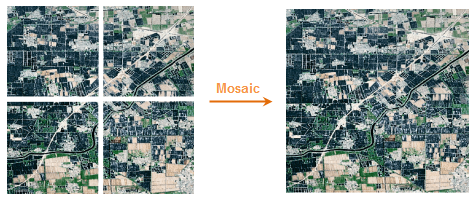
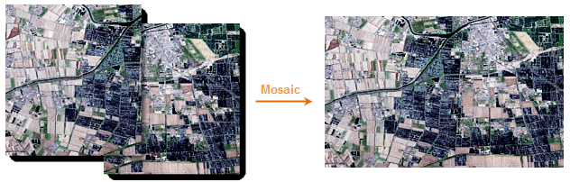

### Introduction

Combine two or more raster datasets into one dataset based on its geographic coordinate system.

e.g.:

  
Figure 1  

  
Figure 2  
  
Figure 1 shows the raster datasets that have no common parts. Figure 2 shows you how to mosaic the taster datasets that have overlaid parts.

### Basic Steps

  1. Click Data Processing, Raster Mosaic.
  2. The Mosaic dialog box pops up.  
  3. Add raster datasets. 
  * Raster dataset type: Grid and Image. But the two types cannot be mixed. 

If you want to change the type, you must delete the added dataset first.

Instruction for Toolbar Button

  *  Click Add, and select raster datasets.
  *  Click Remove to remove datasets.
  *  Click Select All to select all datasets.
  *  Click Select Inverse.
  *  Forward the dataset.
  *  Backward the dataset.
  *  Top the dataset.
  *  Bottom the dataset.

  4. Parameter settings. 

### Parameter Settings

Raster parameter settings

  * Overlay Area Values: Gets cell values, such as elevation, rainfall, etc. There are five approaches: 
    * Same as First: The cell values for the first raster dataset.
    * Same as last: The cell values for the last raster dataset.
    * Max of All Datasets: The max cell value of the raster dataset.
    * Min of All Datasets: The min cell value of the raster dataset.
    * Mean of All Datasets: The mean cell value of the raster dataset.
  * Format: Sets the pixel type for the result dataset. 
    * Same as First: The pixel format for the first raster dataset.
    * Same as Last: The pixel format for the last raster dataset.
    * Highest Precision: The pixel format of the raster dataset that has the highest precision.
    * Lowest Precision: The pixel format of the raster dataset that has the lowest precision.
    * Most Frequent: The pixel format of the raster datasets that have the most frequent.
  * Pixel Format: There are bit1, bit4, bit8, bit16, integer, long integer, float, double. See [Pixel types of raster dataset](../../Analyst/VectorRasterConvert/PixelFormat.htm).
  * NoValue Data: Set a value if the dataset is null.
  * Tolerance: Set the tolerance of the no value data.

Image parameter settings

  * Overlay Area Values: Gets cell values, including color value or color index. There are two approaches: 
      * Same as First: The cell values for the first raster dataset.
      * Same as Last: The cell values for the last raster dataset.
      * Max of All Datasets: Get the max values of R, G, B
      * Min of All Datasets: Get the min values of R, G, B
      * Mean of All Datasets: Get the mean values of R, G, B
  * Format: Sets the pixel type for the result dataset. Notes: The pixel formats do not support the single and double float of image dataset mosaic. 
      * Same as First: The pixel format for the first image dataset.
      * Same as Last: The pixel format for the last image dataset.
      * Highest Precision: The pixel format of the image dataset that has the highest precision.
      * Lowest Precision: The pixel format of the image dataset that has the highest precision.
      * Most Frequent: The pixel format of the image datasets that have the most frequent.
  * Pixel Format: There are Monochrome, 16-color, 256-color, true color, enhanced true color. See [Pixel types of image dataset](../../Analyst/VectorRasterConvert/PixelFormat.htm).
  * Background: If a cell is the same to this color, it will be treated as background color. In this case, the color will not join to operation.
  * Tolerance: Set the tolerance of the background color.

### Result Dataset

  * Datasource: By default the datasource is the dataset to be mosaicked.
  * Dataset: The name of the result dataset.
  * Encoding: SGL, DCT, LZW, PNG, Compound. Default is None. See [Dataset Compact Encoding](../../DataProcessing/DataManagement/EncodeType.htm). 

Encoding for raster dataset:

Original Encoding | Usable Encoding | | | | | | | 
---|---|---|---|---|---|---|---|---|
| | 1 Bit | 4 Bit | Single-byte | Double-byte | Integer | Long integer | Float | Double  
NONE | LZW | LZW | LZW, SGL | LZW, SGL | LZW, SGL | NONE | LZW, SGL | LZW, SGL  
SGL | LZW | LZW | SGL | SGL | SGL | NONE | SGL | SGL  
LZW | LZW | LZW | LZW | LZW | LZW | NONE | LZW | LZW  
  
Encoding for image dataset:

Original Encoding | Usable Encoding | | | | | | | 
---|---|---|---|---|---|---|---|---|
| | Monochrome | 16-color | 256-color | Color | True color | Enhanced color  
NONE | LZW, PNG | LZW, PNG | LZW, DCT, PNG, compound | LZW, DCT, compound | LZW, DCT, PNG, compound | LZW, DCT, PNG, compound  
LZW | LZW | LZW | LZW | LZW | LZW | LZW  
DCT | LZW | LZW | DCT | DCT | DCT | DCT  
PNG | PNG | PNG | PNG | DCT | PNG | PNG  
Compound | LZW | LZW | Compound | Compound | Compound | Compound  

  * Create Image Pyramid: To improve the view speed.
  5. Parameter settings. 
  
Set the extent of the result dataset.

  6. Click OK to perform. 

### Notes

The pixel formats do not support single and double floats of image dataset
mosaic.