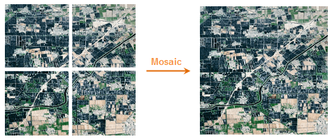
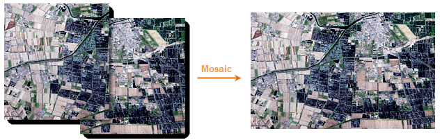

### Introduction

Combines two or more raster datasets to one dataset based on its geographic coordinate system.

e.g.:

Figure 1 shows the raster datasets that have no common parts. Figure 2 shows you how to mosaic the raster datasets that have overlaps.

### Function Entrances

* **Data** > **Data Processing** > **Raster** > **Raster Mosaic**.

### Basic Steps

The **Raster Datasets Mosaic** dialog box contains three parts: dataset list, parameter settings, and environment settings.

1. Add the required raster datasets in the list area. 
* **Mosaic Dataset Type** : the dataset type involved in the operation can be grid or image. But the two types cannot be mixed. 

If you want to change the type, you must delete the added dataset first.

2. The required parameters for image data and raster data are different. The following content introduces parameters in detail.

**Raster data parameter settings**

* **Overlapped Area Values** : Gets cell values, such as elevation, rainfall, etc. There are five approaches: 
* Same as First: The cell values for the first raster dataset.
* Same as last: The cell values for the last raster dataset.
* Max of All Datasets: The max cell value of the raster dataset.
* Min of All Datasets: The min cell value of the raster dataset.
* Mean of All Datasets: The mean cell value of the raster dataset.
* Format: Sets the pixel type for the result dataset. 
* Same as First: The pixel format for the first raster dataset.
* Same as Last: The pixel format for the last raster dataset.
* Highest Precision: The pixel format of the raster dataset that has the highest precision.
* Lowest Precision: The pixel format of the raster dataset that has the lowest precision.
* Most Frequent: The pixel format of the raster datasets that have the most frequent.
* Pixel Format: There are bit1, bit4, bit8, bit16, integer, long integer, float, double. See [Pixel types of raster dataset](../../Analyst/VectorRasterConvert/PixelFormat).
* NoValue Data: Set a value if the dataset is null.
* Tolerance: Set the tolerance of the no value data.

**Image data parameter settings**

* **Overlay Area Values** : Gets cell values, including color value or color index. There are two approaches: 
* Same as the first dataset: The cell values for the first raster dataset.
* Same as the last dataset: The cell values for the last raster dataset.
* Max of All Datasets: Get the maximum R, G, and B respectively from each pixel of all raster datasets resulting in new color values as the values of overlapped areas.
* Min of All Datasets: Get the minimum R, G, and B respectively from each pixel of all raster datasets resulting in new color values as the values of overlapped areas.
* Mean of All Datasets: Get the mean R, G, and B respectively from each pixel of all raster datasets resulting in new color values as the values of overlapped areas.
* **Pixel Format** : Sets the pixel type for the result dataset. Notes: The pixel formats do not support the single and double float of image dataset mosaic. 
* Same as the first dataset: The pixel format for the first image dataset.
* Same as the last dataset: The pixel format for the last image dataset.
* Highest Accuracy: The pixel format of the image dataset that has the highest precision.
* Lowest Accuracy: The pixel format of the image dataset that has the highest precision.
* Highest Frequence: The pixel format of the image datasets that have the most frequent.
* **Custom Pixel Format** : There are Monochrome, 16-color, 256-color, true color, enhanced true color. See [Pixel types of image dataset](../../Analyst/VectorRasterConvert/PixelFormat).
* **Background** : If a cell is the same to this color, it will be treated as background color. In this case, the color will not join to operation.
* **Tolerance** : Set the tolerance of the background color.

**Result Data**

* **Datasource** : By default the datasource is the dataset to be mosaicked.
* **Dataset** : The name of the result dataset.
* **Encode Type** : SGL, DCT, LZW, PNG, Compound. Default is None. See [Dataset Compact Encoding](../../DataProcessing/DataManagement/EncodeType). 

Encoding for raster dataset:

Original Encoding | 1 Bit | 4 Bit | Single-byte | Double-byte | Integer. | Long integer. | Float | Double
---|--- |--- |--- |--- |--- |--- |---|---
NONE | LZW | LZW | LZW, SGL | LZW, SGL | LZW, SGL | NONE | LZW, SGL | LZW, SGL
SGL | LZW | LZW | SGL | SGL | SGL | NONE | SGL | SGL
LZW | LZW | LZW | LZW | LZW | LZW | NONE | LZW | LZW

Encoding for image dataset:

Original Encoding | Monochrome | 16-color | 256-color | Color | True color | Enhanced color
---|--- |--- |--- |--- |--- |---  
NONE | LZW, PNG | LZW, PNG | LZW, DCT, PNG, compound | LZW, DCT, compound | LZW, DCT, PNG, compound | LZW, DCT, PNG, compound
LZW | LZW | LZW | LZW | LZW | LZW | LZW
DCT | LZW | LZW | DCT | DCT | DCT | DCT
PNG | PNG | PNG | PNG | DCT | PNG | PNG
Compound | LZW | LZW | Compound | Compound | Compound | Compound
* Create Image Pyramid: To improve the view speed.
3. Finish the environment settings for raster datasets. 

Specify the bounds of the result data. **Union of All Datasets** is by
default, which means the union of all bounds of all datasets is used by
default. Or, you can select the bounds of a raster dataset. After that, you
can adjust the bounds with the **Left** , **Top** , **Right** , and **Bottom**
text boxes.

4. Click OK to perform. 

### Notes

The pixel formats do not support single and double floats of image dataset mosaic.
