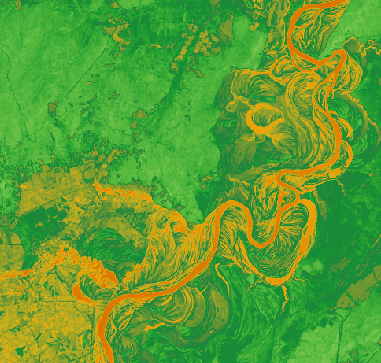

### Function Description

Generally, NDWI (Normalized Difference Water Index) is used to extract water
information from images. Compared to NDVI, NDWI can obtain moisture content
within the vegetation canopy. NDWI can respond to moisture content stress,
which has significant meanings to drought monitoring. But NDWI can't work well
in the extraction of water with much more buildings like cities. Data having a
value greater than 0.2 is water data.

NDWI can be obtained according to green band and near-infrared band. The
expression is **NDWI =(G-NIR)/(G+NIR)**. Among them, G is green band. NIR is
the reflected value of infrared band.

We can calculate NDVI according to multiple kinds of remote-sensing data. We
should know about the types of remote-sensing data and distinguish the meaning
of each band before using the feature. On remote-sensing image introduction,
please refer to [Data Description](NDVI).

###  Operation Instructions

### Function Entrance

Click **Data** tab > **Data Processing** > **NDWI**.

### Parameter Description

1. **Green band** : Select the green band involved in the calculation. You can specify a single-band (green band) dataset or the green band of a multi-band dataset. 
2. **Near-infrared Band** : Select the near-infrared band involved in the calculation. You can specify a single-band (near-infrared band) dataset or the near-infrared band of a multi-band dataset. 
3. **Result Data** : Specify a datasource to save the resulting dataset. The program will produce a raster dataset as the NDVI expression based on the specified green band and near-infrared band.

### Applications

Given two groups of Landsat 8 satellite image data. One is in June of 2013 and
another one is in June of 2018. NDWIs of these two years are obtained through
calculation to view the water information.

###  Related Topic

* [**NDVI**](NDVI)

