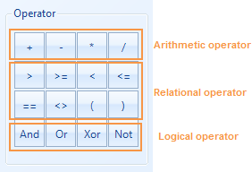
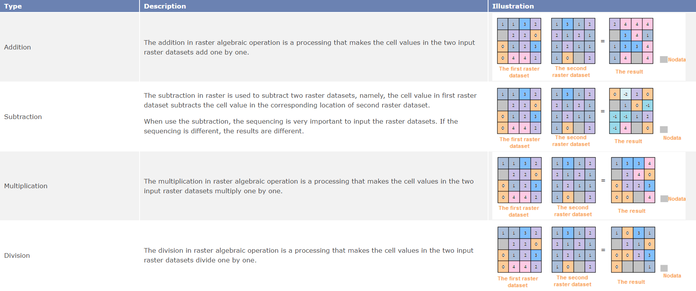

### Introduction

The raster algebraic operation performs the spatial analysis on the
geographical characteristics and phenomena, namely, conduct the mathematics
and functional operation for one or more raster data. The resulting pixel
value is obtained by performing the algebraic operation on the pixel values in the same positions of raster data.

In order to realize the raster algebraic operation, SuperMap provides rich
operators, functions and operation expressions. Except the common operation
expressions (add, subtract, multiply and divide), it supports the custom
expression, such as the arithmetic operation, condition operation, logic
operation, function operation (including common functions and trigonometric
functions, etc.) and composite operation. Users can reach the needs of
multiple raster analysis needs through raster algebraic operation.

### Function Entrances

* **Data** > **Data Processing** > **Raster** > **Algebraic Operation**.
* **Toolbox** > **Data Processing** > **Raster** > **Algebraic Operation**.(iDesktopX)

### Parameter Description

* Set Algebraic Operation Expression: iDesktop could display different types of expressions (dataset, figure, constant, operator, and function) with different font-styles. Besides, right-click in the expression box and select the option ( **Cut** , **Copy** , **Paste** , **Clear** ) you want to edit your expression. You can also use the Windows shortcut key to edit. (such as Ctrl+X, Ctrl+C, Ctrl+V, Delete and so on). When editing the algebraic operation expression, it is recommended to edit your expression as a whole to save its font style. 

Besides, the composition of algebraic operation expression should follow this rule:

* When the reference dataset is the operation data, the format is [Datasource name, Dataset name]. For example, the reference data of dataset BeijingTerrain in datasource Jingjin is: [Jingjin. BeijingTerrain].
* The operand of arithmetic operator can be a dataset, figure or constant (the result of a functional operation).
* The argument of a math function can be a numerical value, a dataset, or the operation expression of one or more datasets.
* When the operand is negative, you should add the ().
* The expression should contain least a input raster dataset.
* **Common Functions**

In addition to the commonly used operators, SuperMap also provides 21 kinds of
commonly used functions, including arithmetic functions, trigonometric
functions, index/four logarithmic function and other functions. The following
will detailed introduce the contents of all kinds of function.

Common Function Use

<table class="normaltable" width="80%">
<thead>
<tr class="normaltableTitle">
<td width="20%">Type</td>
<td width="20%">Description</td>
<td width="60%">Illustration</td>
</tr>
</thead>
<tr class="normaltablecontent2">
<td rowspan="3">Arithmetical Function</td>
<td>abs(x)</td>
<td>The absolute value.</td>
</tr>
<tr class="normaltablecontent1">
<td>mod(x, y)</td>
<td>The modulo function, namely, get the remainder of x/y. The output value is integral value. When the y &gt; X, mod(x, y) = x.</td>
</tr>
<tr class="normaltablecontent2">
<td>floor(x)</td>
<td>The rounding down function, namely, get the closest smaller integer to x. The output value is floating point.</td>
</tr>
<tr class="normaltablecontent1">
<td rowspan="11">Trigonometric Function</td>
<td>sin(x)</td>
<td>The sine function</td>
</tr>
<tr class="normaltablecontent2">
<td>cos(x)</td>
<td>The cosine function</td>
</tr>
<tr class="normaltablecontent1">
<td>tan(x)</td>
<td>The tangent function </td>
</tr>
<tr class="normaltablecontent2">
<td>cot(x)</td>
<td>The cotangent function</td>
</tr>
<tr class="normaltablecontent1">
<td>asin(x)</td>
<td>The arc-sin function</td>
</tr>
<tr class="normaltablecontent2">
<td>acos(x)</td>
<td>The arc-cosine function</td>
</tr>
<tr class="normaltablecontent1">
<td>atan(x)</td>
<td>The arc-tangent function</td>
</tr>
<tr class="normaltablecontent2">
<td>acot(x)</td>
<td>The arc-cotangent function</td>
</tr>
<tr class="normaltablecontent1">
<td>sinh(x)</td>
<td>The hyperbolic sine function</td>
</tr>
<tr class="normaltablecontent2">
<td>cosh(x)</td>
<td>The hyperbolic cosine function</td>
</tr>
<tr class="normaltablecontent1">
<td>tanh(x)</td>
<td>The hyperbolic tangent function</td>
</tr>
<tr class="normaltablecontent2">
<td rowspan="5">Exponent/Logarithmic Function</td>
<td>exp(x)</td>
<td>The function that the power is natural logarithm.</td>
</tr>
<tr class="normaltablecontent1">
<td>pow(x, y)</td>
<td>pow(x, y)</td>
</tr>
<tr class="normaltablecontent2">
<td>sqrt(x)</td>
<td>sqrt(x)</td>
</tr>
<tr class="normaltablecontent1">
<td>ln(x)</td>
<td>Get the natural logarithm</td>
</tr>
<tr class="normaltablecontent2">
<td>log(x)</td>
<td>log(x)</td>
</tr>
<tr class="normaltablecontent1">
<td rowspan="2">Other Function</td>
<td>Con(x, y, z)</td>
<td>The condition determine function. The x is the condition express (or the value) and y, z are the extraction values. If the function meets the conditions x. extract y; Otherwise, z.</td>
</tr>
<tr class="normaltablecontent2">
<td>IsNull(x)</td>
<td>Check whether the expression contains none. If the x is null (none), return 1; otherwise, return 0.</td>
</tr>
<tr class="normaltablecontent1">
<td>pick(n1,n2,n3,...,nn)</td>
<td>Update Grid. Update the first grids with new grid values from another grid dataset or from input value.</td>

</tr>
</table>

* Common Operator 

SuperMap provides the common operators, as shown below, including basic
arithmetic operators, relation operators and logical operators. Click the
button to display the corresponding operators to the expression dialog box.

### Arithmetic Operation

The common arithmetic operations have: addition (+), subtraction (-),
multiplication (*) and division (/). The following table introduces how to use
these operators in the raster algebraic operation in detail.

Introduction for Arithmetic Operator

### Logical Operation

The logical operation, also known as bool operation, determines the "true" or
"false" for the cell values of inputting raster dataset, and output them in
the format of (1,0). The results are represented by 1 or 0. 1 means "true",
namely meets the raster pixels of the algebraic operation expression; 0
represents "false" in logical, and means don't meet the raster pixels of the
algebraic operation expression.

The common logical operations include And, Or, Not and Xor. The following
introduces the methods of logical operations on detail.

Introduction for Logical Operator

* And: It means "And", represented by &. If and only if the raster dataset meets two algebraic operations, the pixel value is true and be assigned 1; Otherwise, false and 0.
* Or: It means logical "or", represented by |. When the cell value of raster dataset meets one of the two algebraic operations, the cell value is true, assigned 1. If the cell value of raster dataset doesn't meet the two algebraic operations, the cell value is false, assigned 0.
* Not: It means logical "Not", represented by Not( ). If the value of raster dataset doesn't meet two algebraic operations, the pixel value is true and be assigned 1; Otherwise, false and 0.
* Xor: It means logical "Xor", represented by ^. If and only if the cell value of raster dataset meets one of the two algebraic operations, the cell value is true, assigned 1; If the cell value of raster dataset meet the two algebraic operations, the cell value is false, assigned 0.

* Result Data 
* Datasource: List all the datasources in current workspace and select the datasource that the result dataset wants to save.
* Dataset: Set the name of the result dataset.
* Pixel Format: Set the pixel format of the result dataset. The application provides 1 bit, 4 bit, 8 bit, 16 bit, 32 bit, and 64 bit. See [Pixel Format of Grid Dataset](../../Analyst/VectorRasterConvert/PixelFormat) for more information about pixel format.
* Compress Dataset for Storage: Check this box and the system will compress storage for the result datasets, or it doesn't compress storage. 
* Ignore NoValue Cells: After check this box, the no value pixels in raster dataset won't attend the algebraic operation. The corresponding cell value in result dataset is NoValue (usually it is -9999) too; If you don't check this box, the system will make the no value pixels attend the algebraic operation, and it will make the minimum value or maximum value of result raster dataset change. 

Input the no value pixels of raster dataset and you can view them in the properties window. The detail steps are as follows:

* In the workspace manager, right click the input raster dataset participated in the raster algebraic operation. Click the "Properties" in the pop up context menu.
* Click the raster dataset node in the directory tree on the left of the pop-up "Properties" window. You can see the null cell value on the right image property region (namely the NoValue cell), and it is usually -9999. 
* Import/Export the parameters of algebraic operations. Users can set the parameters of "Raster Algebraic Operation" through the "Import/Export" buttons on the bottom left. 
* import: Click "Import" button. The algebraic operation configuration file saved as *.xml will be imported into the "Raster Algebraic Operation" dialog box.
* Export: Click the "Export" button. You can save the algebraic operations in the expression dialog box and the related parameter settings as *.xml format, which is convenient for you to reuse. The structure is as follows: 

Export the File Structure

Copy

<?xml version="1.0" encoding="UTF-8"?>
<SmXml:MathOperation xmlns:SmXml="http://www.supermap.com/xml">
<SmXml:Expression>Con( [DEM.dem] > 1000,1,-9999)</SmXml:Expression>;
<SmXml:PixelFormat>6400</SmXml:PixelFormat>
<SmXml:BZip>TRUE</SmXml:BZip>
<SmXml:BNoValue>TRUE</SmXml:BNoValue>
<SmXml:BShowProgress>TRUE</SmXml:BShowProgress>
</SmXml:MathOperation>

<Expression> It is used to save the algebraic operation expression in the
dialog box.

<PixelFormat> represents the pixel type of result dataset. 1 represents 1 bit;
4 represents 4 bits; 8 represents single bytes; 16 represents double bytes;
320 represents integer; 64 represents long integer; 3200 represents single-
precision float, 6400 represents double-precision float.

<BZip> represents whether to conduct the compression storage for datasets.
FALSE is not and TRUE means to.

<BNoValue> represents whether to ignore the NoData grid cell. TRUE means to
ignore; Otherwise ,FALSE.

<BShowProgress> represents whether to show the progress bar.

* Click "Environment Settings" button to open the "Environment Setting for Raster Analysis" where you can set the analysis parameters to values as needed. For detail operations, please refer to [Setting the Analysis Environment](../../Raster/AnalystEnvironment). 

Note: you are allowed to specify the environment parameters as global
variables, then you do not need to set the parameters again in other
operations. Also the system can read parameter values specified in the raster
analysis environment if you do not set parameters here.

* After finished the parameter settings, click "OK" button to execute raster algebraic operation.

