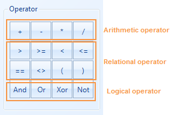
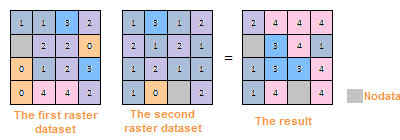
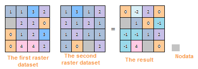
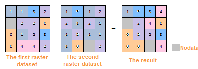
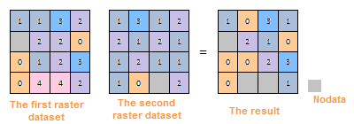

### Introduction

The raster algebraic operation is to use the algebra to conduct the spatial analysis for the geographical characteristics and phenomena, namely, conduct the mathematics and functional operation for one or more raster data. Besides, the cell value of the result raster data is the created by one or more input data in the same location through algebraic operation.

In order to realize the raster algebraic operation, SuperMap provides rich operators, functions and operation expressions. Except the common operation expressions (add, subtract, multiply and divide ), it supports the custom expression, such as the arithmetic operation, condition operation, logic operation, function operation (including common functions and trigonometric functions, etc.) and composite operation. Users can reach the needs of multiple raster analysis needs through raster algebraic operation.

### Basic Steps

  1. In the ribbon Data tab and Data Processing, click the Algebraic Calculation button in the Raster group.
  2. The left lists all the datasources and datasets (Here it only supports the raster/image dataset) under current workspace in the form of tree structure. After double clicking the datasets that need to raster algebraic calculation, the dataset format ([Jingjin. BeijingTerrain]) will be displayed in the right expression box and shown in black bold font.
  3. The right of list box is the expression dialog box and the algebraic operation expression inputted by users will be displayed in it. 

The expressions of different types (include dataset, figure, constant, operator and function) that make up the algebraic operation expression will be displayed in the expression box with different font-styles. Beside, in the expression box, click the right mouse button to select related editable options ("cut", "copy", "paste", "clear the expression") which edit the expression. You can also use the Windows shortcut key to edit. (such as Ctrl+X, Ctrl+C, Ctrl+V, Delete and so on). When edit the algebraic operation expression, it is recommended that edit an expression as a whole, and it can save the special font style.

Besides, the composition of algebraic operation expression should follow this rule:

  * When the reference dataset is the operation data, the format is [Datasource name, Dataset name]. For example, the reference data of dataset BeijingTerrain in datasource Jingjin is: [Jingjin. BeijingTerrain].
  * The operand of arithmetic operator can be a dataset, figure or constant (the result of a functional operation).
  * The argument of a math function can be a numerical value, a dataset, or the operation expression of one or more datasets.
  * When the operand is negative, you should add the ().
  * The expression should contain least a input raster dataset.
  4. Common Functions 

In addition to the commonly used operators, SuperMap also provides 21 kinds of commonly used functions, including arithmetic functions, trigonometric functions, index/four logarithmic function and other functions. The following will detailed introduce the contents of all kinds of function.

Common Function Usages

Type | Description | Illustration  
---|---|---  
Arithmetical Function | abs(x) | The absolute value.  
mod(x, y) | The modulo function, namely, get the remainder of x/y. The output value is integral value. When the y > X, mod(x, y) = x.  
floor(x) | The rounding down function, namely, get the closest smaller integer to x. The output value is floating point.  
Trigonometric Function | sin(x) | The sine function  
cos(x) | The cosine function  
tan(x) | The tangent function  
cot(x) | The cotangent function  
asin(x) | The arc-sin function  
acos(x) | The arc-cosine function  
atan(x) | The arc-tangent function  
acot(x) | The arc-cotangent function  
sinh(x) | The hyperbolic sine function  
cosh(x) | The hyperbolic cosine function  
tanh(x) | The hyperbolic tangent function  
Exponent/Logarithmic Function | exp(x) | The function that the power is natural logarithm.  
pow(x, y) | pow(x, y)  
sqrt(x) | sqrt(x)  
ln(x) | Get the natural logarithm  
log(x) | log(x)  
Other Function | Con(x, y, z) | The condition determine function. The x is the condition express (or the value) and y, z are the extraction values. If the function meets the conditions x. extract y; Otherwise, z.  
IsNull(x) | Check whether the expression contains none. If the x is null (none), return 1; otherwise, return 0.  
pick(n1,n2,n3,...,nn) | Update Grid. Update the first grids with new grid values from another grid dataset or from input value.  
  
  5. Common Operator 

SuperMap provides the common operators, as shown below, including basic arithmetic operators, relation operators and logical operators. Click the button to display the corresponding operators to the expression dialog box.

  

  
### Arithmetic Operation

The common arithmetic operations have: addition (+), subtraction (-), multiplication (*) and division (/). The following table introduces how to use these operators in the raster algebraic operation in detail.

Introduction for Arithmetic Operator

Type | Description | Illustration  
---|---|---  
Addition | The addition in raster algebraic operation is a processing that makes the cell values in the two input raster datasets add one by one. |  
Subtraction | The subtraction in raster is used to subtract two raster datasets, namely, the cell value in first raster dataset subtracts the cell value in the corresponding location of second raster dataset. When use the subtraction, the sequencing is very important to input the raster datasets. If the sequencing is different, the results are different. |   
Multiplication | The multiplication in raster algebraic operation is a processing that makes the cell values in the two input raster datasets multiply one by one. |   
Division | The division in raster algebraic operation is a processing that makes the cell values in the two input raster datasets divide one by one. |  
  
### Logical Operation

The logical operation, also known as bool operation, determines the "true" or "false" for the cell values of inputting raster dataset, and output them in the format of (1,0). The results are represented by 1 or 0. 1 means "true", namely meets the raster pixels of the algebraic operation expression; 0 represents "false" in logical, and means don't meet the raster pixels of the algebraic operation expression.

The common logical operations include And, Or, Not and Xor. The following introduces the methods of logical operations on detail.

Introduction for Logical Operator

  * And: It means "And", represented by &. If and only if the raster dataset meets two algebraic operations, the pixel value is true and be assigned 1; Otherwise, false and 0.
  * Or: It means logical "or", represented by |. When the cell value of raster dataset meets one of the two algebraic operations, the cell value is true, assigned 1. If the cell value of raster dataset doesn't meet the two algebraic operations, the cell value is false, assigned 0.
  * Not: It means logical "Not", represented by Not( ). If the value of raster dataset doesn't meet two algebraic operations, the pixel value is true and be assigned 1; Otherwise, false and 0.
  * Xor: It means logical "Xor", represented by ^. If and only if the cell value of raster dataset meets one of the two algebraic operations, the cell value is true, assigned 1; If the cell value of raster dataset meet the two algebraic operations, the cell value is false, assigned 0.

  6. Result Data 
  * Datasource: List all the datasources in current workspace and select the datasource that the result dataset wants to save.
  * Dataset: Set the name of the result dataset.
  * Pixel Format: Set the pixel format of the result dataset. The application provides 1 bit, 4 bit, 8 bit, 16 bit, 32 bit, and 64 bit. See [Pixel Format of Grid Dataset](../../Analyst/VectorRasterConvert/PixelFormat.htm) for more information about pixel format.
  * Compress Dataset for Storage: Check this box and the system will compress storage for the result datasets, or it doesn't compress storage. 
  * Ignore NoValue Cells: After check this box, the no value pixels in raster dataset won't attend the algebraic operation. The corresponding cell value in result dataset is NoValue (usually it is -9999) too; If you don't check this box, the system will make the no value pixels attend the algebraic operation, and it will make the minimum value or maximum value of result raster dataset change. 

Input the no value pixels of raster dataset and you can view them in the properties window. The detail steps are as follows:

  * In the workspace manager, right click the input raster dataset participated in the raster algebraic operation. Click the "Properties" in the pop up context menu.
  * Click the raster dataset node in the directory tree on the left of the pop-up "Properties" window. You can see the null cell value on the right image property region (namely the NoValue cell), and it is usually -9999. 
  7. Import/Export the parameters of algebraic operations. Users can set the parameters of "Raster Algebraic Operation" through the "Import/Export" buttons on the bottom left. 
  * import: Click "Import" button. The algebraic operation configuration file saved as *.xml will be imported into the "Raster Algebraic Operation" dialog box.
  * Export: Click the "Export" button. You can save the algebraic operations in the expression dialog box and the related parameter settings as *.xml format, which is convenient for you to reuse. The structure is as follows: 

Export the File Structure

Copy

        
                
        <?xml version="1.0" encoding="UTF-8"?>
        <SmXml:MathOperation xmlns:SmXml="http://www.supermap.com/xml">
            <SmXml:Expression>Con( [DEM.dem] > 1000,1,-9999)</SmXml:Expression>;
            <SmXml:PixelFormat>6400</SmXml:PixelFormat>
            <SmXml:BZip>TRUE</SmXml:BZip>
            <SmXml:BNoValue>TRUE</SmXml:BNoValue>
            <SmXml:BShowProgress>TRUE</SmXml:BShowProgress>
        </SmXml:MathOperation>
        
        

<Expression> It is used to save the algebraic operation expression in the dialog box.

<PixelFormat> represents the pixel type of result dataset. 1 represents 1 bit; 4 represents 4 bits; 8 represents single bytes; 16 represents double bytes; 320 represents integer; 64 represents long integer; 3200 represents single-precision float, 6400 represents double-precision float.

<BZip> represents whether to conduct the compression storage for datasets. FALSE is not and TRUE means to.

<BNoValue> represents whether to ignore the NoData grid cell. TRUE means to ignore; Otherwise ,FALSE.

<BShowProgress> represents whether to show the progress bar.

  9. Click "Environment Settings" button to open the "Environment Setting for Raster Analysis" where you can set the analysis parameters to values as needed. For detail operations, please refer to [Setting the Analysis Environment](../../Raster/AnalystEnvironment.htm). 

Note: you are allowed to specify the environment parameters as global variables, then you do not need to set the parameters again in other operations. Also the system can read parameter values specified in the raster analysis environment if you do not set parameters here.

  10. After finished the parameter settings, click "OK" button to execute raster algebraic operation.