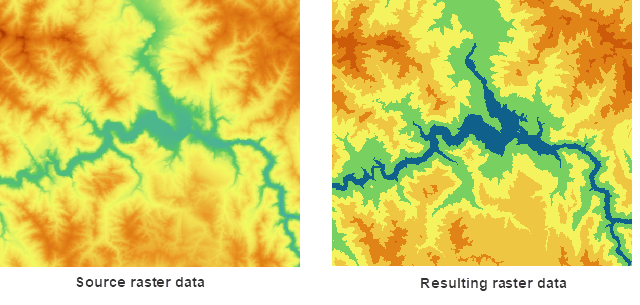

### Introduction

Redefine every pixel value of the raster dataset. The reclassification is only
applicable to the raster datasets (GRID), and isn't applicable to the image
datasets (IMAGE).

Reclassify the cell values of the source raster data and assign them according
to the new classification criterion. The result is that use the new values to
replace the original values of the cell values. For the known raster data, in
order to find out the law of cell value or facilitate the further analysis,
the reclassification is very necessary. The reclassification mainly contains
the following four forms:

* Use the new value to instead of the old pixel value. For example, when change the land type, assign the new cell value to the wasteland that already reclaimed to the farmland.
* Reclassify the cell values and assign the cell in the same group to the same values to simplify data. For example, the arid land, irrigable land and arable land are agricultural land.
* Reclassify the multiple raster data according to the uniform standard. For example, The influence factors of building site include soil and slope. For the soil type and slope raster data of the input data, you can reclassify according to 1-10 ranks, which is easy to further location analysis.
* Assign some cells as no value that don't need to participate in the analysis. You can also set the no value cell as the new value.

### Function Entrances

* **Data** > **Data Processing** > **Raster** > **Raster Reclassifying**.
* **Toolbox** > **Data Processing** > **Raster** > **Reclassify**.(iDesktopX)

### Parameter Description

In the **Raster Reclassifying** dialog box, set the following parameters:

* Set the reclassification value of the cell value of the raster dataset in the list. Each object corresponds to a range, including Lower Value, Upper Value and Target Value three parts. The following content introduces each list. 
* **Lower Value** : The minimum value in each range after classifying the cell values of raster dataset.
* **Upper Value** : The maximum value in each range after classifying the cell values of raster dataset.
* **Target Value** : The new cell value assigned by the source cell value in the classification range.

Instruction of Toolbar Button

* **Merge Records** icon: Click the icon button to merge all selected records (at least two records) in the list box. The records to be merged must be adjacent to each other. The lower value and upper value of the resulting record are the minimum lower value and the maximum value respectively of the merged records 
* **Split Record** icon: Click this icon button to split the selected record into two records evenly in the list box. 
* **Import XML File** icon button: click this icon to import the reclassification configuration file in the format of *.xml. You can reclassify the selected raster dataset according to the existing parameters.
* **Export XML File** icon button: Click the icon button. You can save the reclassification settings and the related parameters in the format of *.xml format for further use. 
* **Reverse Order of Target Values** icon button: click this icon to reverse the target values of records.

Export the File Structure

**Copy**

<?xml version="1.0" encoding="UTF-8"?> 
<SmXml:ReclassMappingTable xmlns:SmXml="http://www.supermap.com/xml">
<SmXml:ReclassType> 2 </SmXml:ReclassType>
<SmXml:SegmentCount count="5">
<SmXml:Range1> 1348.000000 -- 1733.400000: 5.000000-1 </SmXml:Range1>
<SmXml:Range2> 1733.400000 -- 2118.800000: 4.000000-1 </SmXml:Range2>
<SmXml:Range3> 2118.800000 -- 2504.200000: 3.000000-1 </SmXml:Range3>
<SmXml:Range4> 2504.200000 -- 2889.600000: 2.000000-1 </SmXml:Range4>
<SmXml:Range5> 2889.600000 -- 3275.000000: 1.000000-1 </SmXml:Range5>
</SmXml:SegmentCount> 
<SmXml:RetainMissingValue> 1 </SmXml:RetainMissingValue>
<SmXml:RetainNoValue> 1 </SmXml:RetainNoValue> 
<SmXml:ChangeMissingValueTo>0.000000 </SmXml:ChangeMissingValueTo> 
<SmXml:ChangeNoValueTo> -9999.000000</SmXml:ChangeNoValueTo> 
</SmXml:ReclassMappingTable>

<ReclassType> field represents the classification type and 2 represents
classifying according to the range.

<SeqmentCount> field represents the series. The count = "11" in the sample
represents 11 levels.

<Rangei> field represents the range of the reclassification and i represents
the steps. There are 11 steps in the sample, so we should set 11 fields
reclassification information from Range 1 to Range 11. The field contents can
be divided into three parts: original cell value, the new cell value and the
range type. The range type is represented by 1 or 0. 1 means Closed Left and
Open Right and 0 means Open Left and Closed Right.

<RetainMissingValue> field means to handle the missing values. 0 means to and
1 means not.

<RetainNoValue> field means to handle the nodata values. 0 means to and 1
means not.

<ChangeMissingValueTo> field to the target value of missing values.

<ChangeNoValueTo> field represents the target value after no value

* **Source Data** : specify the dataset that you want to reclassify.
* **Result Data** : select a datasource to save the resulting data. The default name of the resulting dataset is the same as the datasource name.
* **Pixel Format** : Set the pixel format of the result dataset. The system provides integer, long integer, single precision float and double precision float. See [Pixel Type of Grid Dataset](../../Analyst/VectorRasterConvert/PixelFormat) for more information about pixel format.
* Set the status of closed and open. The open interval means that the border value isn't included in the interval range and closed interval means that the border value is included in the interval range. 
* [L,R): Specify that the left border is in the interval range and the right is out of the interval range.
* (L,R]: Specify that the left border is in out of the interval range and the right is in the interval range.
* Set the class settings. 
* Ranges: Determine the ranges and the default is 10. After inputting the ranges, the system will calculate every ranges with the arithmetic mode according to minimum and maximum values in the raster data. For example, the minimum value is 200 and the maximum value is 1000 in the raster dataset. The input range is 4, so the value of each range are 200, 400, 600, 800 and 1000.
* Interval: Determine every segment value according to the interval. After input the interval, the system will segment and increase until to the maximum value according to the interval. The final value should be less than or equal to the maximum. For example, in the raster datasets, if the interval is set to 200, the segment values are 200, 400, 600, 800 and 1000; If the interval is set to 300, the segment values are 200, 500 and 800. 
* Set the custom target value. 
* NoValue: For the no value in the raster dataset, you can keep the no value status or set a new cell value.
* Unclassified: The unclassified is the unrelated cell values in the left list. You can set a new cell value uniformly.
* Click "Environment Settings" button to open the "Environment Setting for Raster Analysis" where you can set the analysis parameters to values as needed. For detail operations, please refer to [Setting the Analysis Environment](../../Raster/AnalystEnvironment). 

Note: you are allowed to specify the environment parameters as global
variables, then you do not need to set the parameters again in other
operations. Also the system can read parameter values specified in the raster
analysis environment if you do not set parameters here.

* After finished the parameter settings, click "OK" button to execute raster reclassify operation.

